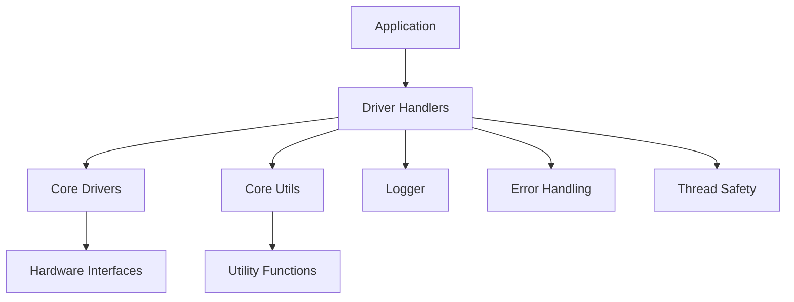

# HardFOC Utils and Drivers

<div align="center">


**A comprehensive collection of high-performance drivers, handlers, and utilities for embedded systems**

[](docs/)
[](examples/)
[](tests/)

</div>

---

## 🚀 Overview

HardFOC Utils and Drivers is a sophisticated embedded systems library that provides unified, high-performance interfaces for a wide range of hardware components. Built with modern C++17, it offers exceptional performance, thread safety, and cross-platform compatibility.

### 🎯 Key Features

- **🔧 Unified Hardware Abstraction**: Consistent interfaces across different hardware platforms
- **⚡ High Performance**: Optimized for real-time embedded applications
- **🛡️ Thread Safety**: Full RTOS support with mutex protection
- **🎨 Modern C++**: Leverages C++17 features for clean, maintainable code
- **📊 Comprehensive Diagnostics**: Built-in statistics, error handling, and monitoring
- **🔌 Plug-and-Play**: Easy integration with existing projects
- **📚 Extensive Documentation**: Complete API reference and examples

---

## 🏗️ Architecture

The repository is organized into three main components:

```
hf-utils-and-drivers/
├── 📁 driver-handlers/          # High-level device handlers
├── 📁 hf-core-drivers/          # Low-level hardware drivers
└── 📁 hf-core-utils/           # Utility libraries
```

### 🔄 Component Relationships



---

## 📦 Available Components

### 🎮 Driver Handlers

| Component | Description | Status |
|-----------|-------------|--------|
| **AS5047U Handler** | Magnetic rotary position sensor with SPI | ✅ Complete |
| **BNO08X Handler** | 9-DOF IMU sensor with multi-interface support | ✅ Complete |
| **TMC9660 Handler** | Advanced motor controller with GPIO/ADC | ✅ Complete |
| **PCAL95555 Handler** | 16-bit I2C GPIO expander | ✅ Complete |
| **NTC Temperature Handler** | Thermistor temperature sensor | ✅ Complete |
| **Logger** | Advanced logging system with formatting | ✅ Complete |

### 🔧 Core Drivers

| Driver | Description | Interface |
|--------|-------------|-----------|
| **AS5047U** | 14-bit magnetic encoder | SPI |
| **BNO08X** | 9-DOF motion sensor | I2C/SPI/UART |
| **TMC9660** | Motor controller | SPI/UART |
| **PCAL95555** | GPIO expander | I2C |
| **NTC Thermistor** | Temperature sensor | ADC |
| **WS2812** | RGB LED controller | RMT |

### 🛠️ Core Utils

| Utility | Description | Features |
|---------|-------------|----------|
| **General Utils** | Common utilities | CRC, timers, filters |
| **CANopen Utils** | CANopen protocol | Motor control, messaging |
| **RTOS Utils** | RTOS abstractions | Threads, mutexes, queues |
| **Thread-Safe Utils** | Thread-safe containers | Queues, buffers |

---

## 🚀 Quick Start

### 📋 Prerequisites

- **C++17** compatible compiler
- **ESP-IDF** (for ESP32) or **STM32 HAL** (for STM32)
- **CMake** 3.16+ (for building)

### 🔧 Installation

1. **Clone the repository:**
   ```bash
   git clone https://github.com/hardfoc/hf-utils-and-drivers.git
   cd hf-utils-and-drivers
   ```

2. **Initialize submodules:**
   ```bash
   git submodule update --init --recursive
   ```

3. **Include in your project:**
   ```cmake
   add_subdirectory(hf-utils-and-drivers)
   target_link_libraries(your_target hf-utils-and-drivers)
   ```

### 💡 Basic Usage

```cpp
#include "driver-handlers/As5047uHandler.h"
#include "driver-handlers/Logger.h"

// Initialize SPI interface
BaseSpi& spi = GetYourSpiInterface();

// Create handler
As5047uHandler encoder(spi, "ENCODER_1");

// Initialize
if (encoder.Initialize() == As5047uError::SUCCESS) {
    // Read angle
    uint16_t angle;
    if (encoder.ReadAngle(angle) == As5047uError::SUCCESS) {
        Logger::Info("ENCODER", "Angle: %d LSB", angle);
    }
}
```

---

## 📚 Documentation

### 📖 Detailed Guides

- **[Architecture Overview](docs/architecture.md)** - System design and patterns
- **[API Reference](docs/api/)**: Complete API documentation
- **[Examples](docs/examples/)**: Practical usage examples
- **[Integration Guide](docs/integration.md)**: Platform-specific integration

### 🎯 Component Documentation

- **[AS5047U Handler](docs/handlers/as5047u-handler.md)** - Magnetic encoder
- **[BNO08X Handler](docs/handlers/bno08x-handler.md)** - IMU sensor
- **[TMC9660 Handler](docs/handlers/tmc9660-handler.md)** - Motor controller
- **[PCAL95555 Handler](docs/handlers/pcal95555-handler.md)** - GPIO expander
- **[NTC Temperature Handler](docs/handlers/ntc-temperature-handler.md)** - Temperature sensor
- **[Logger](docs/handlers/logger.md)** - Logging system

### 🔧 Driver Documentation

- **[Core Drivers](docs/drivers/)** - Low-level hardware drivers
- **[Core Utils](docs/utils/)** - Utility libraries

---

## 🎨 Design Patterns

### 🏗️ Bridge Pattern

All handlers use the Bridge pattern to abstract hardware interfaces:

```cpp
// Hardware-agnostic interface
BaseSpi& spi_interface = GetPlatformSpi();

// Handler adapts to specific driver
As5047uHandler encoder(spi_interface);
```

### 🔒 Thread Safety

Complete thread safety with RTOS mutex protection:

```cpp
class ExampleHandler {
private:
    mutable RtosMutex mutex_;  // Thread safety
    
public:
    void ThreadSafeOperation() noexcept {
        std::lock_guard<RtosMutex> lock(mutex_);
        // Safe operation
    }
};
```

### 🎯 Error Handling

Comprehensive error handling with specific error codes:

```cpp
enum class HandlerError : uint8_t {
    SUCCESS = 0,
    NOT_INITIALIZED,
    COMMUNICATION_FAILED,
    // ... more specific errors
};
```

---

## 🔧 Platform Support

| Platform | Status | Notes |
|----------|--------|-------|
| **ESP32** | ✅ Full Support | ESP-IDF integration |
| **STM32** | ✅ Full Support | HAL integration |
| **Arduino** | ✅ Full Support | Arduino framework |
| **Generic** | ✅ Full Support | Platform-agnostic |

---

## 🧪 Testing

### 📊 Test Coverage

- **Unit Tests**: Complete coverage for all components
- **Integration Tests**: Cross-component testing
- **Hardware Tests**: Real hardware validation
- **Performance Tests**: Benchmarking and optimization

### 🚀 Running Tests

```bash
# Build and run all tests
cmake --build build --target test

# Run specific test suite
ctest -R "handler_tests"
```

---

## 🤝 Contributing

We welcome contributions! Please see our [Contributing Guide](CONTRIBUTING.md) for details.

### 📋 Development Setup

1. **Fork the repository**
2. **Create a feature branch**
3. **Make your changes**
4. **Add tests**
5. **Submit a pull request**

### 🎯 Code Standards

- **C++17** compliance
- **Clang-format** for formatting
- **Doxygen** for documentation
- **Unit tests** for all new features

---

## 📄 License

This project is licensed under the MIT License - see the [LICENSE](LICENSE) file for details.

---

## 🙏 Acknowledgments

- **HardFOC Team** - Core development
- **Open Source Community** - Driver contributions
- **ESP32 Community** - Platform support
- **STM32 Community** - Platform support

---

## 📞 Support

- **📧 Email**: support@hardfoc.com
- **💬 Discord**: [HardFOC Community](https://discord.gg/hardfoc)
- **📖 Documentation**: [docs.hardfoc.com](https://docs.hardfoc.com)
- **🐛 Issues**: [GitHub Issues](https://github.com/hardfoc/hf-utils-and-drivers/issues)

---

<div align="center">

**Built with ❤️ by the HardFOC Team**

[](https://hardfoc.com)

</div> 