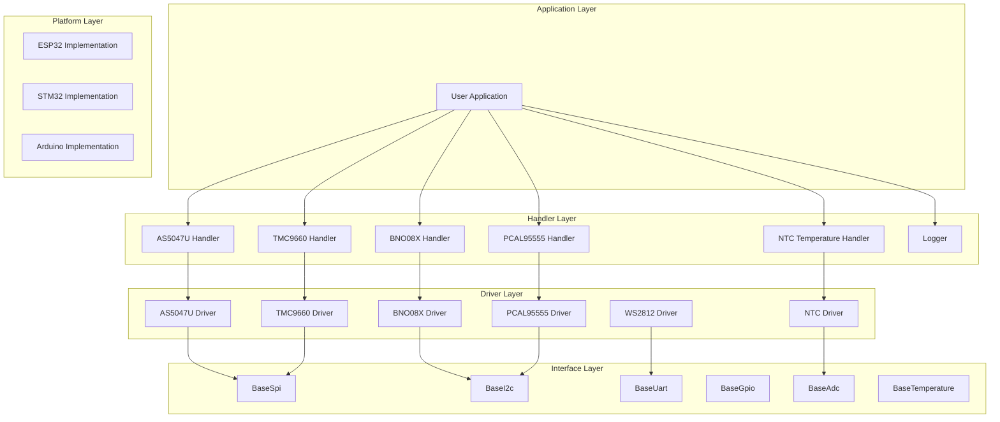
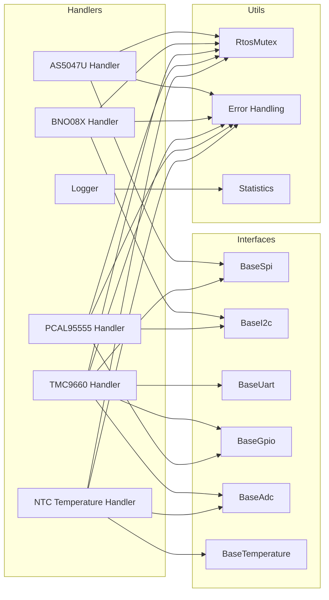
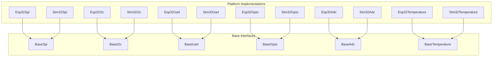
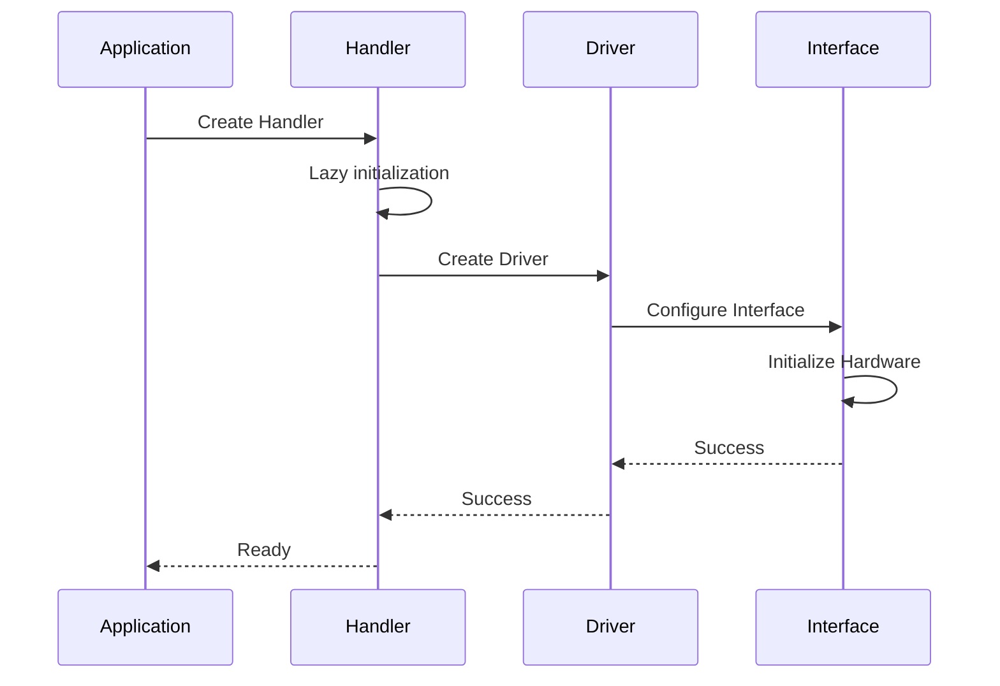
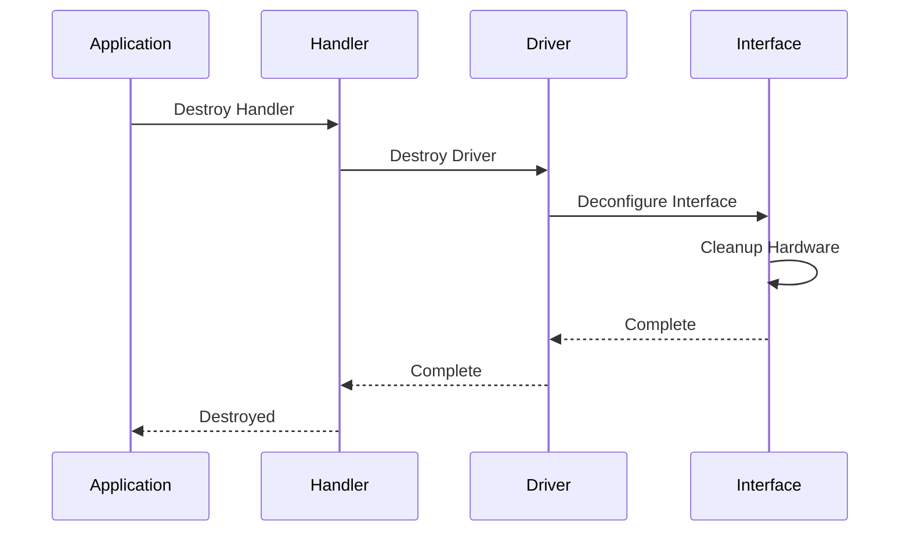

# Architecture Overview

<div align="center">


**System Design and Architectural Patterns**

</div>

---

## 🏗️ System Architecture

The HardFOC Utils and Drivers library is built on a layered architecture that provides clear separation of concerns, maximum reusability, and platform independence.

### 📊 High-Level Architecture



---

## 🎨 Design Patterns

### 🔗 Bridge Pattern

The **Bridge Pattern** is the cornerstone of our architecture, providing hardware abstraction and platform independence.

#### Structure

```cpp
// Abstract interface
class BaseSpi {
public:
    virtual bool Transfer(const uint8_t* tx, uint8_t* rx, size_t len) = 0;
};

// Concrete implementation
class Esp32Spi : public BaseSpi {
public:
    bool Transfer(const uint8_t* tx, uint8_t* rx, size_t len) override;
};

// Bridge adapter
class As5047uSpiAdapter : public AS5047U::spiBus {
private:
    BaseSpi& spi_interface_;
public:
    void transfer(const uint8_t* tx, uint8_t* rx, std::size_t len) override;
};
```

#### Benefits

- **Platform Independence**: Same handler works on ESP32, STM32, Arduino
- **Interface Decoupling**: Handlers don't depend on specific hardware
- **Easy Testing**: Mock interfaces for unit testing
- **Extensibility**: New platforms require only interface implementation

### 🏭 Factory Pattern

The **Factory Pattern** is used for creating multiple instances of handlers with different configurations.

#### Implementation

```cpp
class HandlerFactory {
public:
    static std::unique_ptr<As5047uHandler> CreateEncoder(
        BaseSpi& spi, 
        const std::string& name,
        const As5047uConfig& config = As5047uConfig{}
    );
    
    static std::unique_ptr<Bno08xHandler> CreateImu(
        BaseI2c& i2c,
        const std::string& name,
        const Bno08xConfig& config = Bno08xConfig{}
    );
};
```

### 🔒 Thread Safety Pattern

All handlers implement comprehensive thread safety using the **RAII Pattern** with mutex protection.

#### Implementation

```cpp
class ThreadSafeHandler {
private:
    mutable RtosMutex mutex_;
    
public:
    void SafeOperation() noexcept {
        std::lock_guard<RtosMutex> lock(mutex_);
        // Critical section
    }
    
    bool IsReady() const noexcept {
        std::lock_guard<RtosMutex> lock(mutex_);
        return initialized_;
    }
};
```

### 🎯 Error Handling Pattern

Consistent error handling across all components using **Error Code Pattern**.

#### Structure

```cpp
enum class HandlerError : uint8_t {
    SUCCESS = 0,
    NOT_INITIALIZED,
    COMMUNICATION_FAILED,
    INVALID_PARAMETER,
    TIMEOUT,
    HARDWARE_ERROR
};

// Usage
if (handler.Operation() == HandlerError::SUCCESS) {
    // Success path
} else {
    // Error handling
}
```

---

## 🔄 Component Relationships

### 📦 Handler Dependencies



### 🔗 Interface Hierarchy



---

## 🎯 Design Principles

### 1. **Single Responsibility Principle**

Each component has a single, well-defined responsibility:

- **Handlers**: High-level device abstraction and management
- **Drivers**: Low-level hardware communication
- **Interfaces**: Platform abstraction
- **Utils**: Common functionality

### 2. **Open/Closed Principle**

The system is open for extension but closed for modification:

```cpp
// Easy to extend with new handlers
class NewSensorHandler {
    // Implements same patterns as existing handlers
};

// Easy to extend with new platforms
class NewPlatformSpi : public BaseSpi {
    // Implements platform-specific SPI
};
```

### 3. **Dependency Inversion Principle**

High-level modules don't depend on low-level modules:

```cpp
// Handler depends on abstraction, not concrete implementation
class As5047uHandler {
private:
    BaseSpi& spi_interface_;  // Abstract interface
};
```

### 4. **Interface Segregation Principle**

Clients don't depend on interfaces they don't use:

```cpp
// Separate interfaces for different capabilities
class BaseGpio { /* GPIO operations */ };
class BaseAdc { /* ADC operations */ };
class BaseTemperature { /* Temperature operations */ };
```

---

## 🔧 Memory Management

### 🎯 Smart Pointer Usage

The library uses modern C++ smart pointers for automatic memory management:

```cpp
// Shared ownership for drivers
std::shared_ptr<AS5047U> sensor_driver_;

// Unique ownership for handlers
std::unique_ptr<As5047uHandler> handler_;

// Weak references to avoid circular dependencies
std::weak_ptr<BaseSpi> spi_interface_;
```

### 🧹 RAII Pattern

All resources are managed using RAII (Resource Acquisition Is Initialization):

```cpp
class Handler {
private:
    std::unique_ptr<Driver> driver_;
    RtosMutex mutex_;
    
public:
    Handler() = default;
    ~Handler() = default;  // Automatic cleanup
    
    // No manual memory management needed
};
```

---

## ⚡ Performance Considerations

### 🚀 Optimization Strategies

1. **Lazy Initialization**: Resources allocated only when needed
2. **Move Semantics**: Efficient object transfer
3. **constexpr Functions**: Compile-time calculations
4. **Inline Functions**: Reduced function call overhead
5. **Memory Pooling**: Reuse of frequently allocated objects

### 📊 Performance Metrics

```cpp
// Performance monitoring built into handlers
struct HandlerStatistics {
    uint32_t operation_count;
    uint64_t total_time_us;
    uint32_t error_count;
    uint64_t last_operation_time_us;
};
```

---

## 🛡️ Safety and Reliability

### 🔒 Thread Safety

- **Mutex Protection**: All shared resources protected
- **Atomic Operations**: Lock-free operations where possible
- **Deadlock Prevention**: Consistent locking order
- **Exception Safety**: No-throw guarantees where appropriate

### 🎯 Error Handling

- **Comprehensive Error Codes**: Specific error identification
- **Error Propagation**: Errors bubble up through layers
- **Recovery Mechanisms**: Automatic retry and recovery
- **Diagnostic Information**: Detailed error context

### 🔍 Validation

- **Parameter Validation**: All inputs validated
- **State Validation**: Operations checked against current state
- **Boundary Checking**: Array bounds and limits enforced
- **Type Safety**: Strong typing prevents errors

---

## 🔄 Lifecycle Management

### 📈 Initialization Flow



### 🧹 Cleanup Flow



---

## 🔮 Future Extensibility

### 🎯 Extension Points

1. **New Handlers**: Follow existing patterns
2. **New Platforms**: Implement base interfaces
3. **New Drivers**: Integrate with existing handlers
4. **New Utils**: Add to utility libraries

### 📋 Extension Guidelines

- **Consistent Patterns**: Follow established design patterns
- **Interface Compliance**: Implement required interfaces
- **Error Handling**: Use consistent error codes
- **Thread Safety**: Ensure thread-safe operations
- **Documentation**: Document all public APIs

---

## 📚 Related Documentation

- **[API Reference](api/)** - Complete API documentation
- **[Examples](examples/)** - Practical usage examples
- **[Integration Guide](integration.md)** - Platform-specific integration
- **[Component Documentation](handlers/)** - Individual component guides 