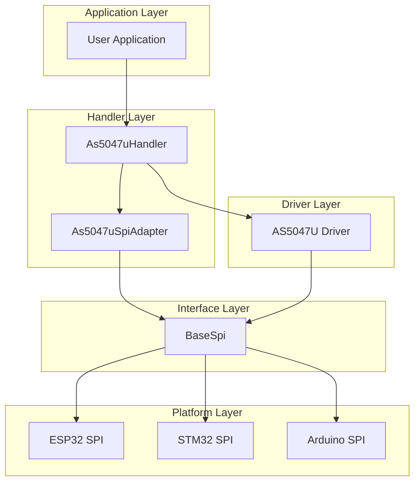

# AS5047U Handler

<div align="center">


**High-Performance Magnetic Rotary Position Sensor Handler**

</div>

---

## 🎯 Overview

The **AS5047U Handler** provides a unified, high-performance interface for the AS5047U magnetic rotary position sensor. This handler implements the Bridge pattern to abstract hardware interfaces, ensuring platform independence and easy integration.

### ✨ Key Features

- **🔧 14-bit Resolution**: 0-16383 LSB per revolution (0.022° resolution)
- **⚡ High Performance**: Up to 1MHz SPI communication
- **🔄 Dynamic Angle Error Compensation (DAEC)**: Automatic error correction
- **🎯 Multiple Interfaces**: ABI, UVW, PWM output configuration
- **🛡️ Thread Safety**: Full RTOS support with mutex protection
- **📊 Comprehensive Diagnostics**: Magnetic field monitoring, error detection
- **🔌 Plug-and-Play**: Easy integration with existing projects
- **🎨 Modern C++**: Exception-free design with noexcept methods

---

## 🏗️ Architecture

### 📊 Component Structure



### 🔗 Bridge Pattern Implementation

The handler uses the Bridge pattern to abstract hardware interfaces:

```cpp
// Abstract SPI interface
class BaseSpi {
public:
    virtual bool Transfer(const uint8_t* tx, uint8_t* rx, size_t len) = 0;
};

// Bridge adapter connecting BaseSpi to AS5047U driver
class As5047uSpiAdapter : public AS5047U::spiBus {
private:
    BaseSpi& spi_interface_;
public:
    void transfer(const uint8_t* tx, uint8_t* rx, std::size_t len) noexcept override;
};
```

---

## 📋 API Reference

### 🏗️ Construction and Initialization

#### Constructor

```cpp
explicit As5047uHandler(
    BaseSpi& spi_interface,
    const std::string& sensor_name = "AS5047U",
    const As5047uConfig& config = As5047uConfig{}
) noexcept;
```

**Parameters:**
- `spi_interface`: Reference to SPI interface implementation
- `sensor_name`: Optional sensor identifier for logging
- `config`: Optional configuration structure

#### Initialization

```cpp
As5047uError Initialize() noexcept;
```

**Returns:** `As5047uError::SUCCESS` if initialization successful

**Example:**
```cpp
BaseSpi& spi = GetPlatformSpi();
As5047uHandler encoder(spi, "MOTOR_ENCODER");

if (encoder.Initialize() == As5047uError::SUCCESS) {
    Logger::Info("ENCODER", "AS5047U initialized successfully");
} else {
    Logger::Error("ENCODER", "AS5047U initialization failed");
}
```

### 📊 Measurement Operations

#### Read Complete Measurement

```cpp
As5047uError ReadMeasurement(As5047uMeasurement& measurement) noexcept;
```

**Parameters:**
- `measurement`: Output structure containing all sensor data

**Returns:** `As5047uError::SUCCESS` if successful

**Example:**
```cpp
As5047uMeasurement measurement;
if (encoder.ReadMeasurement(measurement) == As5047uError::SUCCESS) {
    Logger::Info("ENCODER", "Angle: %d LSB, Velocity: %.2f RPM", 
                 measurement.angle_compensated, measurement.velocity_rpm);
}
```

#### Read Angle

```cpp
As5047uError ReadAngle(uint16_t& angle) noexcept;
As5047uError ReadRawAngle(uint16_t& raw_angle) noexcept;
```

**Parameters:**
- `angle`: Output angle value (0-16383 LSB, 14-bit)
- `raw_angle`: Output raw angle without DAEC compensation

**Returns:** `As5047uError::SUCCESS` if successful

**Example:**
```cpp
uint16_t angle;
if (encoder.ReadAngle(angle) == As5047uError::SUCCESS) {
    double degrees = As5047uHandler::LSBToDegrees(angle);
    Logger::Info("ENCODER", "Angle: %.2f degrees", degrees);
}
```

#### Read Velocity

```cpp
As5047uError ReadVelocity(int16_t& velocity_lsb) noexcept;
As5047uError ReadVelocityDegPerSec(double& velocity_deg_per_sec) noexcept;
As5047uError ReadVelocityRadPerSec(double& velocity_rad_per_sec) noexcept;
As5047uError ReadVelocityRPM(double& velocity_rpm) noexcept;
```

**Parameters:**
- `velocity_lsb`: Output velocity in LSB units (signed 14-bit)
- `velocity_deg_per_sec`: Output velocity in degrees/second
- `velocity_rad_per_sec`: Output velocity in radians/second
- `velocity_rpm`: Output velocity in RPM

**Example:**
```cpp
double velocity_rpm;
if (encoder.ReadVelocityRPM(velocity_rpm) == As5047uError::SUCCESS) {
    Logger::Info("ENCODER", "Velocity: %.2f RPM", velocity_rpm);
}
```

### 🔍 Diagnostic Operations

#### Read Diagnostics

```cpp
As5047uError ReadDiagnostics(As5047uDiagnostics& diagnostics) noexcept;
```

**Parameters:**
- `diagnostics`: Output diagnostic information

**Example:**
```cpp
As5047uDiagnostics diagnostics;
if (encoder.ReadDiagnostics(diagnostics) == As5047uError::SUCCESS) {
    if (diagnostics.magnetic_field_ok) {
        Logger::Info("ENCODER", "Magnetic field OK");
    } else {
        Logger::Warn("ENCODER", "Magnetic field weak");
    }
}
```

#### Read AGC and Magnitude

```cpp
As5047uError ReadAGC(uint8_t& agc_value) noexcept;
As5047uError ReadMagnitude(uint16_t& magnitude) noexcept;
```

**Parameters:**
- `agc_value`: Output Automatic Gain Control value (0-255)
- `magnitude`: Output magnetic field magnitude (0-16383)

### ⚙️ Configuration Operations

#### Set Zero Position

```cpp
As5047uError SetZeroPosition(uint16_t zero_position) noexcept;
As5047uError GetZeroPosition(uint16_t& zero_position) noexcept;
```

**Parameters:**
- `zero_position`: Zero position in LSB (0-16383)

#### Configure DAEC and Filtering

```cpp
As5047uError SetDAEC(bool enable) noexcept;
As5047uError SetAdaptiveFilter(bool enable) noexcept;
```

**Parameters:**
- `enable`: True to enable feature

#### Configure Interface Outputs

```cpp
As5047uError ConfigureInterface(
    bool enable_abi, 
    bool enable_uvw, 
    bool enable_pwm
) noexcept;
```

**Parameters:**
- `enable_abi`: Enable ABI incremental output
- `enable_uvw`: Enable UVW commutation output
- `enable_pwm`: Enable PWM output

#### Set ABI and UVW Parameters

```cpp
As5047uError SetABIResolution(uint8_t resolution_bits) noexcept;
As5047uError SetUVWPolePairs(uint8_t pole_pairs) noexcept;
```

**Parameters:**
- `resolution_bits`: ABI resolution in bits (10-14)
- `pole_pairs`: UVW pole pairs (1-7)

### 🔧 Advanced Operations

#### OTP Programming

```cpp
As5047uError ProgramOTP() noexcept;
```

**⚠️ Warning:** OTP can only be programmed once. Ensure correct configuration before calling.

#### Calibration

```cpp
As5047uError PerformCalibration() noexcept;
As5047uError ResetToDefaults() noexcept;
```

#### Configuration Management

```cpp
As5047uError UpdateConfiguration(const As5047uConfig& config) noexcept;
As5047uError GetConfiguration(As5047uConfig& config) noexcept;
```

---

## 📊 Data Structures

### 🔢 Measurement Structure

```cpp
struct As5047uMeasurement {
    uint16_t angle_raw;              ///< Raw angle (0-16383 LSB)
    uint16_t angle_compensated;      ///< DAEC compensated angle (0-16383 LSB)
    int16_t velocity_raw;            ///< Raw velocity (signed 14-bit)
    double velocity_deg_per_sec;     ///< Velocity in degrees per second
    double velocity_rad_per_sec;     ///< Velocity in radians per second
    double velocity_rpm;             ///< Velocity in revolutions per minute
    uint8_t agc_value;               ///< Automatic Gain Control value (0-255)
    uint16_t magnitude;              ///< Magnetic field magnitude (0-16383)
    uint16_t error_flags;            ///< Current error flags
    bool valid;                      ///< True if measurement is valid
};
```

### 🔍 Diagnostics Structure

```cpp
struct As5047uDiagnostics {
    bool magnetic_field_ok;          ///< Magnetic field strength is adequate
    bool agc_warning;                ///< AGC at minimum or maximum
    bool cordic_overflow;            ///< CORDIC algorithm overflow
    bool offset_compensation_ok;     ///< Offset compensation completed
    bool communication_ok;           ///< SPI communication working
    uint16_t last_error_flags;       ///< Last error flags read
    uint32_t communication_errors;   ///< Count of communication errors
    uint32_t total_measurements;     ///< Total measurements taken
};
```

### ⚙️ Configuration Structure

```cpp
struct As5047uConfig {
    FrameFormat frame_format;        ///< SPI frame format (16/24/32-bit)
    uint8_t crc_retries;             ///< Number of CRC error retries
    bool enable_daec;                ///< Enable Dynamic Angle Error Compensation
    bool enable_adaptive_filter;     ///< Enable adaptive filtering
    uint16_t zero_position;          ///< Zero position offset (0-16383)
    bool enable_abi_output;          ///< Enable ABI incremental output
    bool enable_uvw_output;          ///< Enable UVW commutation output
    bool enable_pwm_output;          ///< Enable PWM output
    uint8_t abi_resolution_bits;     ///< ABI resolution in bits (10-14)
    uint8_t uvw_pole_pairs;          ///< UVW pole pairs (1-7)
    bool high_temperature_mode;      ///< Enable 150°C operation mode
};
```

---

## 🎯 Error Handling

### 📋 Error Codes

```cpp
enum class As5047uError : uint8_t {
    SUCCESS = 0,
    NOT_INITIALIZED,
    INITIALIZATION_FAILED,
    INVALID_PARAMETER,
    SPI_COMMUNICATION_FAILED,
    CRC_ERROR,
    FRAMING_ERROR,
    SENSOR_ERROR,
    OTP_PROGRAMMING_FAILED,
    CALIBRATION_FAILED,
    TIMEOUT,
    MUTEX_LOCK_FAILED
};
```

### 🔧 Error Handling Example

```cpp
As5047uError result = encoder.ReadAngle(angle);
switch (result) {
    case As5047uError::SUCCESS:
        // Process successful reading
        break;
    case As5047uError::NOT_INITIALIZED:
        Logger::Error("ENCODER", "Sensor not initialized");
        break;
    case As5047uError::SPI_COMMUNICATION_FAILED:
        Logger::Error("ENCODER", "SPI communication failed");
        break;
    case As5047uError::CRC_ERROR:
        Logger::Warn("ENCODER", "CRC error detected");
        break;
    default:
        Logger::Error("ENCODER", "Unknown error: %s", 
                     As5047uErrorToString(result));
        break;
}
```

---

## 💡 Usage Examples

### 🔧 Basic Setup and Reading

```cpp
#include "driver-handlers/As5047uHandler.h"
#include "driver-handlers/Logger.h"

// Get SPI interface from platform
BaseSpi& spi = GetPlatformSpi();

// Create handler with default configuration
As5047uHandler encoder(spi, "MOTOR_ENCODER");

// Initialize sensor
if (encoder.Initialize() != As5047uError::SUCCESS) {
    Logger::Error("ENCODER", "Failed to initialize AS5047U");
    return;
}

// Read angle continuously
while (true) {
    uint16_t angle;
    if (encoder.ReadAngle(angle) == As5047uError::SUCCESS) {
        double degrees = As5047uHandler::LSBToDegrees(angle);
        Logger::Info("ENCODER", "Angle: %.2f degrees", degrees);
    }
    
    // Read velocity
    double velocity_rpm;
    if (encoder.ReadVelocityRPM(velocity_rpm) == As5047uError::SUCCESS) {
        Logger::Info("ENCODER", "Velocity: %.2f RPM", velocity_rpm);
    }
    
    // Check diagnostics
    As5047uDiagnostics diagnostics;
    if (encoder.ReadDiagnostics(diagnostics) == As5047uError::SUCCESS) {
        if (!diagnostics.magnetic_field_ok) {
            Logger::Warn("ENCODER", "Magnetic field weak - check magnet");
        }
    }
    
    // Delay between readings
    vTaskDelay(pdMS_TO_TICKS(10));
}
```

### ⚙️ Advanced Configuration

```cpp
// Create handler with custom configuration
As5047uConfig config;
config.enable_daec = true;
config.enable_adaptive_filter = true;
config.zero_position = 8192;  // Set zero at 180 degrees
config.enable_abi_output = true;
config.abi_resolution_bits = 12;
config.high_temperature_mode = false;

As5047uHandler encoder(spi, "MOTOR_ENCODER", config);

// Initialize
if (encoder.Initialize() != As5047uError::SUCCESS) {
    return;
}

// Read complete measurement
As5047uMeasurement measurement;
if (encoder.ReadMeasurement(measurement) == As5047uError::SUCCESS) {
    Logger::Info("ENCODER", "Complete measurement:");
    Logger::Info("ENCODER", "  Raw angle: %d LSB", measurement.angle_raw);
    Logger::Info("ENCODER", "  Compensated angle: %d LSB", measurement.angle_compensated);
    Logger::Info("ENCODER", "  Velocity: %.2f RPM", measurement.velocity_rpm);
    Logger::Info("ENCODER", "  AGC: %d", measurement.agc_value);
    Logger::Info("ENCODER", "  Magnitude: %d", measurement.magnitude);
}
```

### 🔍 Diagnostic Monitoring

```cpp
// Monitor sensor health
void MonitorSensorHealth(As5047uHandler& encoder) {
    As5047uDiagnostics diagnostics;
    if (encoder.ReadDiagnostics(diagnostics) == As5047uError::SUCCESS) {
        // Check magnetic field
        if (!diagnostics.magnetic_field_ok) {
            Logger::Error("ENCODER", "Magnetic field too weak");
        }
        
        // Check AGC
        if (diagnostics.agc_warning) {
            Logger::Warn("ENCODER", "AGC at limit - check magnet distance");
        }
        
        // Check CORDIC overflow
        if (diagnostics.cordic_overflow) {
            Logger::Error("ENCODER", "CORDIC overflow detected");
        }
        
        // Check communication
        if (!diagnostics.communication_ok) {
            Logger::Error("ENCODER", "SPI communication issues");
        }
        
        // Log statistics
        Logger::Info("ENCODER", "Total measurements: %d", diagnostics.total_measurements);
        Logger::Info("ENCODER", "Communication errors: %d", diagnostics.communication_errors);
    }
}
```

### 🔧 Calibration and Setup

```cpp
// Perform sensor calibration
void CalibrateSensor(As5047uHandler& encoder) {
    Logger::Info("ENCODER", "Starting sensor calibration...");
    
    // Reset to defaults
    if (encoder.ResetToDefaults() != As5047uError::SUCCESS) {
        Logger::Error("ENCODER", "Failed to reset sensor");
        return;
    }
    
    // Enable DAEC
    if (encoder.SetDAEC(true) != As5047uError::SUCCESS) {
        Logger::Error("ENCODER", "Failed to enable DAEC");
        return;
    }
    
    // Enable adaptive filtering
    if (encoder.SetAdaptiveFilter(true) != As5047uError::SUCCESS) {
        Logger::Error("ENCODER", "Failed to enable adaptive filter");
        return;
    }
    
    // Perform calibration
    if (encoder.PerformCalibration() != As5047uError::SUCCESS) {
        Logger::Error("ENCODER", "Calibration failed");
        return;
    }
    
    Logger::Info("ENCODER", "Calibration completed successfully");
}
```

---

## 🔧 Utility Functions

### 📐 Conversion Functions

```cpp
// Convert LSB to degrees
static constexpr double LSBToDegrees(uint16_t angle_lsb) noexcept;

// Convert LSB to radians
static constexpr double LSBToRadians(uint16_t angle_lsb) noexcept;

// Convert degrees to LSB
static constexpr uint16_t DegreesToLSB(double degrees) noexcept;

// Convert radians to LSB
static constexpr uint16_t RadiansToLSB(double radians) noexcept;
```

**Example:**
```cpp
uint16_t angle_lsb = 8192;  // 180 degrees
double degrees = As5047uHandler::LSBToDegrees(angle_lsb);  // 180.0
double radians = As5047uHandler::LSBToRadians(angle_lsb);  // π

uint16_t new_lsb = As5047uHandler::DegreesToLSB(90.0);    // 4096
```

---

## 🛡️ Thread Safety

The AS5047U Handler is fully thread-safe with the following guarantees:

### 🔒 Thread Safety Features

- **Mutex Protection**: All operations protected by `RtosMutex`
- **Atomic Operations**: State variables use atomic operations
- **Exception Safety**: All methods are `noexcept`
- **Deadlock Prevention**: Consistent locking order

### 🔄 Concurrent Access

```cpp
// Safe concurrent access from multiple threads
void Thread1Function(As5047uHandler& encoder) {
    uint16_t angle;
    if (encoder.ReadAngle(angle) == As5047uError::SUCCESS) {
        // Process angle data
    }
}

void Thread2Function(As5047uHandler& encoder) {
    double velocity_rpm;
    if (encoder.ReadVelocityRPM(velocity_rpm) == As5047uError::SUCCESS) {
        // Process velocity data
    }
}

// Both threads can safely access the same handler instance
```

---

## ⚡ Performance Considerations

### 🚀 Optimization Tips

1. **Batch Operations**: Use `ReadMeasurement()` for multiple values
2. **Error Handling**: Check return codes to avoid unnecessary operations
3. **Diagnostic Monitoring**: Monitor diagnostics periodically, not every read
4. **Configuration**: Set optimal configuration for your application

### 📊 Performance Metrics

- **SPI Frequency**: Up to 1MHz
- **Read Latency**: < 100μs per measurement
- **Memory Usage**: ~2KB RAM per handler instance
- **CPU Usage**: < 1% for typical applications

---

## 🔧 Hardware Requirements

### 📋 Electrical Specifications

- **Supply Voltage**: 3.3V ±10%
- **SPI Interface**: 3.3V logic levels
- **Magnetic Field**: 30-100 mT (recommended 50 mT)
- **Temperature Range**: -40°C to +125°C (150°C with high temp mode)

### 🔌 Pin Connections

| Pin | Function | Description |
|-----|----------|-------------|
| VDD | Power | 3.3V supply |
| GND | Ground | Common ground |
| CS | Chip Select | SPI chip select (active low) |
| MOSI | Master Out | SPI data from MCU |
| MISO | Master In | SPI data to MCU |
| SCK | Clock | SPI clock |
| ABI_A | ABI Output | Incremental encoder output A |
| ABI_B | ABI Output | Incremental encoder output B |
| UVW_U | UVW Output | Commutation output U |
| UVW_V | UVW Output | Commutation output V |
| UVW_W | UVW Output | Commutation output W |
| PWM | PWM Output | PWM output |

### 🧲 Magnet Requirements

- **Type**: Diametrically magnetized cylindrical magnet
- **Material**: NdFeB (Neodymium Iron Boron)
- **Size**: 6mm diameter, 2.5mm height (typical)
- **Distance**: 0.5-3mm from sensor surface
- **Field Strength**: 30-100 mT at sensor surface

---

## 🐛 Troubleshooting

### 🔍 Common Issues

#### 1. Initialization Failures

**Symptoms:** `INITIALIZATION_FAILED` error
**Causes:**
- Incorrect SPI configuration
- Hardware connection issues
- Power supply problems

**Solutions:**
- Verify SPI pin connections
- Check power supply voltage
- Ensure proper SPI mode (CPOL=0, CPHA=0)

#### 2. Communication Errors

**Symptoms:** `SPI_COMMUNICATION_FAILED` or `CRC_ERROR`
**Causes:**
- SPI timing issues
- Noise on SPI lines
- Incorrect SPI configuration

**Solutions:**
- Reduce SPI frequency
- Add pull-up resistors
- Check PCB layout for noise

#### 3. Magnetic Field Issues

**Symptoms:** `magnetic_field_ok = false` in diagnostics
**Causes:**
- Magnet too far from sensor
- Magnet too weak
- Wrong magnet type

**Solutions:**
- Adjust magnet distance (0.5-3mm)
- Use stronger magnet
- Ensure diametrically magnetized magnet

#### 4. High AGC Values

**Symptoms:** `agc_warning = true` in diagnostics
**Causes:**
- Magnet too close to sensor
- Magnet too strong
- Magnetic interference

**Solutions:**
- Increase magnet distance
- Use weaker magnet
- Remove magnetic interference sources

### 🔧 Debugging Tips

1. **Enable Verbose Logging**: Use Logger with DEBUG level
2. **Monitor Diagnostics**: Check diagnostics regularly
3. **Verify Configuration**: Use `GetConfiguration()` to verify settings
4. **Test with Known Good Setup**: Compare with working configuration

---

## 📚 Related Documentation

- **[Architecture Overview](../architecture.md)** - System design and patterns
- **[BNO08X Handler](bno08x-handler.md)** - IMU sensor handler
- **[TMC9660 Handler](tmc9660-handler.md)** - Motor controller handler
- **[Logger](logger.md)** - Logging system
- **[BaseSpi Interface](../api/base-spi.md)** - SPI interface documentation 