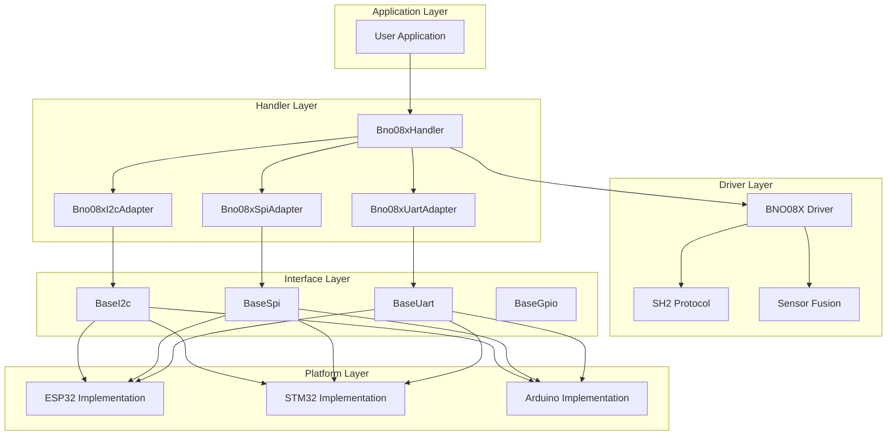

# BNO08X Handler

<div align="center">


**Advanced 9-DOF Inertial Measurement Unit Handler**

</div>

---

## 🎯 Overview

The **BNO08X Handler** provides a unified, high-performance interface for the BNO08X family of 9-DOF inertial measurement units. This handler supports multiple communication interfaces (I2C, SPI, UART) and implements advanced sensor fusion algorithms for precise motion tracking.

### ✨ Key Features

- **🔧 9-DOF Sensing**: Accelerometer, gyroscope, and magnetometer
- **🧠 Advanced Sensor Fusion**: Quaternion and Euler angle orientation
- **⚡ Multiple Interfaces**: I2C, SPI, and UART communication
- **🎯 Motion Detection**: Tap, shake, step counting, and activity classification
- **🔄 Calibration Management**: Automatic and manual calibration
- **🛡️ Thread Safety**: Full RTOS support with mutex protection
- **📊 Comprehensive Diagnostics**: Sensor accuracy monitoring
- **🔌 Plug-and-Play**: Easy integration with existing projects
- **🎨 Modern C++**: Exception-free design with noexcept methods

---

## 🏗️ Architecture

### 📊 Component Structure



### 🔗 Multi-Interface Bridge Pattern

The handler supports multiple communication interfaces through adapter classes:

```cpp
// Abstract interfaces
class BaseI2c { /* I2C operations */ };
class BaseSpi { /* SPI operations */ };
class BaseUart { /* UART operations */ };

// Bridge adapters for different interfaces
class Bno08xI2cAdapter : public BNO085_Transport {
    BaseI2c& i2c_interface_;
};

class Bno08xSpiAdapter : public BNO085_Transport {
    BaseSpi& spi_interface_;
};

class Bno08xUartAdapter : public BNO085_Transport {
    BaseUart& uart_interface_;
};
```

---

## 📋 API Reference

### 🏗️ Construction and Initialization

#### Constructor (I2C)

```cpp
explicit Bno08xHandler(
    BaseI2c& i2c_interface,
    const std::string& sensor_name = "BNO08X",
    const Bno08xConfig& config = Bno08xConfig{}
) noexcept;
```

#### Constructor (SPI)

```cpp
explicit Bno08xHandler(
    BaseSpi& spi_interface,
    BaseGpio& cs_pin,
    const std::string& sensor_name = "BNO08X",
    const Bno08xConfig& config = Bno08xConfig{}
) noexcept;
```

#### Constructor (UART)

```cpp
explicit Bno08xHandler(
    BaseUart& uart_interface,
    const std::string& sensor_name = "BNO08X",
    const Bno08xConfig& config = Bno08xConfig{}
) noexcept;
```

**Parameters:**
- `i2c_interface`/`spi_interface`/`uart_interface`: Communication interface
- `cs_pin`: Chip select pin (SPI only)
- `sensor_name`: Optional sensor identifier for logging
- `config`: Optional configuration structure

#### Initialization

```cpp
Bno08xError Initialize() noexcept;
```

**Returns:** `Bno08xError::SUCCESS` if initialization successful

**Example:**
```cpp
BaseI2c& i2c = GetPlatformI2c();
Bno08xHandler imu(i2c, "MAIN_IMU");

if (imu.Initialize() == Bno08xError::SUCCESS) {
    Logger::Info("IMU", "BNO08X initialized successfully");
} else {
    Logger::Error("IMU", "BNO08X initialization failed");
}
```

### 📊 Sensor Data Operations

#### Read Orientation (Quaternion)

```cpp
Bno08xError ReadQuaternion(Bno08xQuaternion& quaternion) noexcept;
Bno08xError ReadEulerAngles(Bno08xEulerAngles& euler) noexcept;
```

**Parameters:**
- `quaternion`: Output quaternion orientation
- `euler`: Output Euler angles (roll, pitch, yaw)

**Example:**
```cpp
Bno08xQuaternion quat;
if (imu.ReadQuaternion(quat) == Bno08xError::SUCCESS) {
    Logger::Info("IMU", "Quaternion: w=%.3f, x=%.3f, y=%.3f, z=%.3f",
                 quat.w, quat.x, quat.y, quat.z);
}

Bno08xEulerAngles euler;
if (imu.ReadEulerAngles(euler) == Bno08xError::SUCCESS) {
    Logger::Info("IMU", "Euler: Roll=%.2f°, Pitch=%.2f°, Yaw=%.2f°",
                 euler.roll_deg, euler.pitch_deg, euler.yaw_deg);
}
```

#### Read Acceleration

```cpp
Bno08xError ReadAcceleration(Bno08xVector3& acceleration) noexcept;
Bno08xError ReadLinearAcceleration(Bno08xVector3& linear_accel) noexcept;
Bno08xError ReadGravity(Bno08xVector3& gravity) noexcept;
```

**Parameters:**
- `acceleration`: Raw acceleration vector
- `linear_accel`: Linear acceleration (gravity removed)
- `gravity`: Gravity vector

#### Read Angular Velocity

```cpp
Bno08xError ReadAngularVelocity(Bno08xVector3& angular_velocity) noexcept;
```

**Parameters:**
- `angular_velocity`: Angular velocity vector (rad/s)

#### Read Magnetic Field

```cpp
Bno08xError ReadMagneticField(Bno08xVector3& magnetic_field) noexcept;
```

**Parameters:**
- `magnetic_field`: Magnetic field vector (μT)

### 🎯 Motion Detection

#### Configure Motion Detection

```cpp
Bno08xError EnableTapDetection(bool enable) noexcept;
Bno08xError EnableShakeDetection(bool enable) noexcept;
Bno08xError EnableStepCounting(bool enable) noexcept;
Bno08xError EnableActivityClassification(bool enable) noexcept;
```

#### Read Motion Events

```cpp
Bno08xError ReadTapEvent(Bno08xTapEvent& tap_event) noexcept;
Bno08xError ReadShakeEvent(Bno08xShakeEvent& shake_event) noexcept;
Bno08xError ReadStepCount(uint32_t& step_count) noexcept;
Bno08xError ReadActivity(Bno08xActivity& activity) noexcept;
```

**Example:**
```cpp
// Enable tap detection
imu.EnableTapDetection(true);

// Check for tap events
Bno08xTapEvent tap_event;
if (imu.ReadTapEvent(tap_event) == Bno08xError::SUCCESS) {
    Logger::Info("IMU", "Tap detected on axis %d", tap_event.axis);
}

// Enable step counting
imu.EnableStepCounting(true);

// Read step count
uint32_t steps;
if (imu.ReadStepCount(steps) == Bno08xError::SUCCESS) {
    Logger::Info("IMU", "Step count: %d", steps);
}
```

### 🔧 Calibration Operations

#### Sensor Calibration

```cpp
Bno08xError StartCalibration(Bno08xCalibrationType type) noexcept;
Bno08xError StopCalibration() noexcept;
Bno08xError GetCalibrationStatus(Bno08xCalibrationStatus& status) noexcept;
```

**Calibration Types:**
- `ACCELEROMETER`: Accelerometer calibration
- `GYROSCOPE`: Gyroscope calibration
- `MAGNETOMETER`: Magnetometer calibration
- `PLANAR_ACCELEROMETER`: Planar accelerometer calibration

**Example:**
```cpp
// Start magnetometer calibration
imu.StartCalibration(Bno08xCalibrationType::MAGNETOMETER);

// Monitor calibration progress
Bno08xCalibrationStatus status;
while (true) {
    if (imu.GetCalibrationStatus(status) == Bno08xError::SUCCESS) {
        if (status.magnetometer_calibrated) {
            Logger::Info("IMU", "Magnetometer calibration complete");
            break;
        }
        Logger::Info("IMU", "Calibrating magnetometer...");
    }
    vTaskDelay(pdMS_TO_TICKS(100));
}

// Stop calibration
imu.StopCalibration();
```

### ⚙️ Configuration Operations

#### Sensor Configuration

```cpp
Bno08xError SetAccelerometerRange(Bno08xAccelRange range) noexcept;
Bno08xError SetGyroscopeRange(Bno08xGyroRange range) noexcept;
Bno08xError SetMagnetometerRange(Bno08xMagRange range) noexcept;
```

**Ranges:**
- **Accelerometer**: ±2g, ±4g, ±8g, ±16g
- **Gyroscope**: ±2000°/s, ±1000°/s, ±500°/s, ±250°/s, ±125°/s
- **Magnetometer**: ±4900μT, ±2500μT, ±1200μT, ±1600μT

#### Report Configuration

```cpp
Bno08xError EnableReport(Bno08xReportType type, uint32_t interval_ms) noexcept;
Bno08xError DisableReport(Bno08xReportType type) noexcept;
```

**Report Types:**
- `ROTATION_VECTOR`: Quaternion orientation
- `GAME_ROTATION_VECTOR`: Game quaternion (no magnetometer)
- `GEOMAGNETIC_ROTATION_VECTOR`: Geomagnetic quaternion
- `ACCELEROMETER`: Raw acceleration
- `LINEAR_ACCELERATION`: Linear acceleration
- `GRAVITY`: Gravity vector
- `GYROSCOPE`: Angular velocity
- `MAGNETOMETER`: Magnetic field
- `STEP_COUNTER`: Step counting
- `TAP_DETECTOR`: Tap detection
- `SHAKE_DETECTOR`: Shake detection
- `ACTIVITY_CLASSIFIER`: Activity classification

**Example:**
```cpp
// Enable quaternion reports at 20ms intervals
imu.EnableReport(Bno08xReportType::ROTATION_VECTOR, 20);

// Enable linear acceleration at 10ms intervals
imu.EnableReport(Bno08xReportType::LINEAR_ACCELERATION, 10);

// Disable gyroscope reports
imu.DisableReport(Bno08xReportType::GYROSCOPE);
```

### 🔍 Diagnostic Operations

#### Read Diagnostics

```cpp
Bno08xError ReadDiagnostics(Bno08xDiagnostics& diagnostics) noexcept;
```

**Parameters:**
- `diagnostics`: Output diagnostic information

#### Read Sensor Accuracy

```cpp
Bno08xError ReadSensorAccuracy(Bno08xSensorAccuracy& accuracy) noexcept;
```

**Parameters:**
- `accuracy`: Output sensor accuracy information

---

## 📊 Data Structures

### 🧭 Orientation Structures

```cpp
struct Bno08xQuaternion {
    float w;                         ///< Quaternion w component
    float x;                         ///< Quaternion x component
    float y;                         ///< Quaternion y component
    float z;                         ///< Quaternion z component
    uint64_t timestamp_us;           ///< Timestamp in microseconds
    bool valid;                      ///< True if data is valid
};

struct Bno08xEulerAngles {
    float roll_deg;                  ///< Roll angle in degrees
    float pitch_deg;                 ///< Pitch angle in degrees
    float yaw_deg;                   ///< Yaw angle in degrees
    uint64_t timestamp_us;           ///< Timestamp in microseconds
    bool valid;                      ///< True if data is valid
};
```

### 📐 Vector Structures

```cpp
struct Bno08xVector3 {
    float x;                         ///< X component
    float y;                         ///< Y component
    float z;                         ///< Z component
    uint64_t timestamp_us;           ///< Timestamp in microseconds
    bool valid;                      ///< True if data is valid
};
```

### 🎯 Motion Event Structures

```cpp
struct Bno08xTapEvent {
    uint8_t axis;                    ///< Tap axis (0=X, 1=Y, 2=Z)
    bool double_tap;                 ///< True if double tap
    uint64_t timestamp_us;           ///< Timestamp in microseconds
};

struct Bno08xShakeEvent {
    uint8_t axis;                    ///< Shake axis (0=X, 1=Y, 2=Z)
    float intensity;                 ///< Shake intensity
    uint64_t timestamp_us;           ///< Timestamp in microseconds
};

struct Bno08xActivity {
    Bno08xActivityType type;         ///< Activity type
    float confidence;                ///< Confidence level (0.0-1.0)
    uint64_t timestamp_us;           ///< Timestamp in microseconds
};
```

### 🔧 Configuration Structure

```cpp
struct Bno08xConfig {
    Bno08xInterfaceType interface_type;  ///< Communication interface
    uint8_t i2c_address;                 ///< I2C address (if using I2C)
    Bno08xAccelRange accel_range;        ///< Accelerometer range
    Bno08xGyroRange gyro_range;          ///< Gyroscope range
    Bno08xMagRange mag_range;            ///< Magnetometer range
    bool enable_wake_on_motion;          ///< Enable wake on motion
    bool enable_fast_mode;               ///< Enable fast mode
    uint32_t default_report_interval_ms; ///< Default report interval
};
```

### 🔍 Diagnostic Structures

```cpp
struct Bno08xDiagnostics {
    bool communication_ok;           ///< Communication working
    bool sensor_responding;          ///< Sensor responding
    uint32_t communication_errors;   ///< Count of communication errors
    uint32_t total_reports;          ///< Total reports received
    uint64_t last_report_time_us;    ///< Last report timestamp
    Bno08xCalibrationStatus calibration; ///< Calibration status
};

struct Bno08xCalibrationStatus {
    bool accelerometer_calibrated;   ///< Accelerometer calibrated
    bool gyroscope_calibrated;       ///< Gyroscope calibrated
    bool magnetometer_calibrated;    ///< Magnetometer calibrated
    bool planar_accelerometer_calibrated; ///< Planar accelerometer calibrated
};
```

---

## 🎯 Error Handling

### 📋 Error Codes

```cpp
enum class Bno08xError : uint8_t {
    SUCCESS = 0,
    NOT_INITIALIZED,
    INITIALIZATION_FAILED,
    INVALID_PARAMETER,
    COMMUNICATION_FAILED,
    SENSOR_NOT_RESPONDING,
    CALIBRATION_FAILED,
    FIRMWARE_UPDATE_FAILED,
    TIMEOUT,
    MUTEX_LOCK_FAILED,
    INVALID_INTERFACE,
    SENSOR_NOT_ENABLED,
    DATA_NOT_AVAILABLE,
    HARDWARE_ERROR
};
```

### 🔧 Error Handling Example

```cpp
Bno08xError result = imu.ReadQuaternion(quat);
switch (result) {
    case Bno08xError::SUCCESS:
        // Process successful reading
        break;
    case Bno08xError::NOT_INITIALIZED:
        Logger::Error("IMU", "Sensor not initialized");
        break;
    case Bno08xError::COMMUNICATION_FAILED:
        Logger::Error("IMU", "Communication failed");
        break;
    case Bno08xError::DATA_NOT_AVAILABLE:
        Logger::Warn("IMU", "No data available");
        break;
    default:
        Logger::Error("IMU", "Unknown error: %s", 
                     Bno08xErrorToString(result));
        break;
}
```

---

## 💡 Usage Examples

### 🔧 Basic Setup and Reading

```cpp
#include "driver-handlers/Bno08xHandler.h"
#include "driver-handlers/Logger.h"

// Get I2C interface from platform
BaseI2c& i2c = GetPlatformI2c();

// Create handler with default configuration
Bno08xHandler imu(i2c, "MAIN_IMU");

// Initialize sensor
if (imu.Initialize() != Bno08xError::SUCCESS) {
    Logger::Error("IMU", "Failed to initialize BNO08X");
    return;
}

// Enable orientation reports
imu.EnableReport(Bno08xReportType::ROTATION_VECTOR, 20);

// Read orientation continuously
while (true) {
    Bno08xQuaternion quat;
    if (imu.ReadQuaternion(quat) == Bno08xError::SUCCESS) {
        Logger::Info("IMU", "Quaternion: w=%.3f, x=%.3f, y=%.3f, z=%.3f",
                     quat.w, quat.x, quat.y, quat.z);
    }
    
    // Read Euler angles
    Bno08xEulerAngles euler;
    if (imu.ReadEulerAngles(euler) == Bno08xError::SUCCESS) {
        Logger::Info("IMU", "Euler: Roll=%.2f°, Pitch=%.2f°, Yaw=%.2f°",
                     euler.roll_deg, euler.pitch_deg, euler.yaw_deg);
    }
    
    // Delay between readings
    vTaskDelay(pdMS_TO_TICKS(20));
}
```

### ⚙️ Advanced Configuration

```cpp
// Create handler with custom configuration
Bno08xConfig config;
config.interface_type = Bno08xInterfaceType::I2C;
config.i2c_address = 0x4A;
config.accel_range = Bno08xAccelRange::RANGE_4G;
config.gyro_range = Bno08xGyroRange::RANGE_500DPS;
config.mag_range = Bno08xMagRange::RANGE_1600UT;
config.enable_wake_on_motion = true;
config.default_report_interval_ms = 10;

Bno08xHandler imu(i2c, "MAIN_IMU", config);

// Initialize
if (imu.Initialize() != Bno08xError::SUCCESS) {
    return;
}

// Enable multiple reports
imu.EnableReport(Bno08xReportType::ROTATION_VECTOR, 20);
imu.EnableReport(Bno08xReportType::LINEAR_ACCELERATION, 10);
imu.EnableReport(Bno08xReportType::GYROSCOPE, 10);

// Read multiple sensor data
Bno08xVector3 linear_accel;
Bno08xVector3 angular_velocity;

if (imu.ReadLinearAcceleration(linear_accel) == Bno08xError::SUCCESS) {
    Logger::Info("IMU", "Linear Accel: x=%.2f, y=%.2f, z=%.2f m/s²",
                 linear_accel.x, linear_accel.y, linear_accel.z);
}

if (imu.ReadAngularVelocity(angular_velocity) == Bno08xError::SUCCESS) {
    Logger::Info("IMU", "Angular Vel: x=%.2f, y=%.2f, z=%.2f rad/s",
                 angular_velocity.x, angular_velocity.y, angular_velocity.z);
}
```

### 🎯 Motion Detection Example

```cpp
// Enable motion detection features
imu.EnableTapDetection(true);
imu.EnableShakeDetection(true);
imu.EnableStepCounting(true);
imu.EnableActivityClassification(true);

// Monitor motion events
void MonitorMotionEvents(Bno08xHandler& imu) {
    // Check for tap events
    Bno08xTapEvent tap_event;
    if (imu.ReadTapEvent(tap_event) == Bno08xError::SUCCESS) {
        const char* axis_names[] = {"X", "Y", "Z"};
        Logger::Info("IMU", "%s tap detected on %s axis",
                     tap_event.double_tap ? "Double" : "Single",
                     axis_names[tap_event.axis]);
    }
    
    // Check for shake events
    Bno08xShakeEvent shake_event;
    if (imu.ReadShakeEvent(shake_event) == Bno08xError::SUCCESS) {
        const char* axis_names[] = {"X", "Y", "Z"};
        Logger::Info("IMU", "Shake detected on %s axis, intensity: %.2f",
                     axis_names[shake_event.axis], shake_event.intensity);
    }
    
    // Read step count
    uint32_t steps;
    if (imu.ReadStepCount(steps) == Bno08xError::SUCCESS) {
        Logger::Info("IMU", "Step count: %d", steps);
    }
    
    // Read activity classification
    Bno08xActivity activity;
    if (imu.ReadActivity(activity) == Bno08xError::SUCCESS) {
        Logger::Info("IMU", "Activity: %s (confidence: %.1f%%)",
                     ActivityTypeToString(activity.type),
                     activity.confidence * 100.0f);
    }
}
```

### 🔧 Calibration Example

```cpp
// Perform sensor calibration
void CalibrateSensors(Bno08xHandler& imu) {
    Logger::Info("IMU", "Starting sensor calibration...");
    
    // Calibrate accelerometer
    Logger::Info("IMU", "Calibrating accelerometer...");
    imu.StartCalibration(Bno08xCalibrationType::ACCELEROMETER);
    
    Bno08xCalibrationStatus status;
    while (true) {
        if (imu.GetCalibrationStatus(status) == Bno08xError::SUCCESS) {
            if (status.accelerometer_calibrated) {
                Logger::Info("IMU", "Accelerometer calibration complete");
                break;
            }
        }
        vTaskDelay(pdMS_TO_TICKS(100));
    }
    
    // Calibrate gyroscope
    Logger::Info("IMU", "Calibrating gyroscope...");
    imu.StartCalibration(Bno08xCalibrationType::GYROSCOPE);
    
    while (true) {
        if (imu.GetCalibrationStatus(status) == Bno08xError::SUCCESS) {
            if (status.gyroscope_calibrated) {
                Logger::Info("IMU", "Gyroscope calibration complete");
                break;
            }
        }
        vTaskDelay(pdMS_TO_TICKS(100));
    }
    
    // Calibrate magnetometer (requires figure-8 motion)
    Logger::Info("IMU", "Calibrating magnetometer (move in figure-8 pattern)...");
    imu.StartCalibration(Bno08xCalibrationType::MAGNETOMETER);
    
    while (true) {
        if (imu.GetCalibrationStatus(status) == Bno08xError::SUCCESS) {
            if (status.magnetometer_calibrated) {
                Logger::Info("IMU", "Magnetometer calibration complete");
                break;
            }
        }
        vTaskDelay(pdMS_TO_TICKS(100));
    }
    
    imu.StopCalibration();
    Logger::Info("IMU", "All sensors calibrated successfully");
}
```

---

## 🛡️ Thread Safety

The BNO08X Handler is fully thread-safe with the following guarantees:

### 🔒 Thread Safety Features

- **Mutex Protection**: All operations protected by `RtosMutex`
- **Atomic Operations**: State variables use atomic operations
- **Exception Safety**: All methods are `noexcept`
- **Deadlock Prevention**: Consistent locking order

### 🔄 Concurrent Access

```cpp
// Safe concurrent access from multiple threads
void OrientationThread(Bno08xHandler& imu) {
    Bno08xQuaternion quat;
    while (true) {
        if (imu.ReadQuaternion(quat) == Bno08xError::SUCCESS) {
            // Process orientation data
        }
        vTaskDelay(pdMS_TO_TICKS(20));
    }
}

void MotionThread(Bno08xHandler& imu) {
    while (true) {
        // Check for motion events
        Bno08xTapEvent tap_event;
        if (imu.ReadTapEvent(tap_event) == Bno08xError::SUCCESS) {
            // Process tap event
        }
        vTaskDelay(pdMS_TO_TICKS(10));
    }
}

// Both threads can safely access the same handler instance
```

---

## ⚡ Performance Considerations

### 🚀 Optimization Tips

1. **Report Intervals**: Set appropriate report intervals for your application
2. **Selective Reports**: Enable only the reports you need
3. **Batch Processing**: Process multiple sensor readings together
4. **Error Handling**: Check return codes to avoid unnecessary operations

### 📊 Performance Metrics

- **I2C Frequency**: Up to 400kHz (Fast Mode)
- **SPI Frequency**: Up to 1MHz
- **UART Baud Rate**: Up to 921600 bps
- **Report Latency**: < 1ms for enabled reports
- **Memory Usage**: ~4KB RAM per handler instance
- **CPU Usage**: < 2% for typical applications

---

## 🔧 Hardware Requirements

### 📋 Electrical Specifications

- **Supply Voltage**: 1.71V to 3.6V
- **I2C Interface**: 1.71V to 3.6V logic levels
- **SPI Interface**: 1.71V to 3.6V logic levels
- **UART Interface**: 1.71V to 3.6V logic levels
- **Temperature Range**: -40°C to +85°C

### 🔌 Pin Connections

#### I2C Interface

| Pin | Function | Description |
|-----|----------|-------------|
| VDD | Power | 1.71V to 3.6V supply |
| GND | Ground | Common ground |
| SDA | I2C Data | I2C data line |
| SCL | I2C Clock | I2C clock line |
| INT | Interrupt | Interrupt output (optional) |
| RST | Reset | Hardware reset (optional) |

#### SPI Interface

| Pin | Function | Description |
|-----|----------|-------------|
| VDD | Power | 1.71V to 3.6V supply |
| GND | Ground | Common ground |
| CS | Chip Select | SPI chip select (active low) |
| MOSI | Master Out | SPI data from MCU |
| MISO | Master In | SPI data to MCU |
| SCK | Clock | SPI clock |
| INT | Interrupt | Interrupt output (optional) |
| RST | Reset | Hardware reset (optional) |

#### UART Interface

| Pin | Function | Description |
|-----|----------|-------------|
| VDD | Power | 1.71V to 3.6V supply |
| GND | Ground | Common ground |
| TX | Transmit | UART transmit |
| RX | Receive | UART receive |
| INT | Interrupt | Interrupt output (optional) |
| RST | Reset | Hardware reset (optional) |

---

## 🐛 Troubleshooting

### 🔍 Common Issues

#### 1. Initialization Failures

**Symptoms:** `INITIALIZATION_FAILED` error
**Causes:**
- Incorrect interface configuration
- Hardware connection issues
- Power supply problems
- Wrong I2C address

**Solutions:**
- Verify interface pin connections
- Check power supply voltage
- Ensure correct I2C address (default: 0x4A or 0x4B)
- Check interface configuration

#### 2. Communication Errors

**Symptoms:** `COMMUNICATION_FAILED` or `SENSOR_NOT_RESPONDING`
**Causes:**
- Interface timing issues
- Noise on communication lines
- Incorrect interface configuration
- Sensor not powered

**Solutions:**
- Reduce interface frequency
- Add pull-up resistors (I2C)
- Check PCB layout for noise
- Verify power supply

#### 3. Calibration Issues

**Symptoms:** Sensors not calibrating properly
**Causes:**
- Insufficient motion during calibration
- Magnetic interference
- Sensor mounting issues

**Solutions:**
- Follow calibration motion patterns
- Remove magnetic interference sources
- Ensure proper sensor mounting
- Allow sufficient time for calibration

#### 4. Poor Orientation Accuracy

**Symptoms:** Inaccurate quaternion or Euler angles
**Causes:**
- Uncalibrated sensors
- Magnetic interference
- Sensor mounting issues

**Solutions:**
- Perform full sensor calibration
- Remove magnetic interference
- Ensure proper sensor mounting
- Check for nearby ferromagnetic materials

### 🔧 Debugging Tips

1. **Enable Verbose Logging**: Use Logger with DEBUG level
2. **Monitor Diagnostics**: Check diagnostics regularly
3. **Verify Configuration**: Use `GetConfiguration()` to verify settings
4. **Test with Known Good Setup**: Compare with working configuration
5. **Check Calibration Status**: Monitor calibration progress

---

## 📚 Related Documentation

- **[Architecture Overview](../architecture.md)** - System design and patterns
- **[AS5047U Handler](as5047u-handler.md)** - Magnetic encoder handler
- **[TMC9660 Handler](tmc9660-handler.md)** - Motor controller handler
- **[Logger](logger.md)** - Logging system
- **[BaseI2c Interface](../api/base-i2c.md)** - I2C interface documentation
- **[BaseSpi Interface](../api/base-spi.md)** - SPI interface documentation
- **[BaseUart Interface](../api/base-uart.md)** - UART interface documentation 