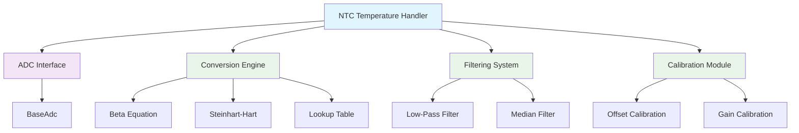

# NTC Temperature Handler

## Overview

The **NTC Temperature Handler** is a unified interface for NTC (Negative Temperature Coefficient) thermistor temperature sensors, providing high-level temperature measurement capabilities through ADC integration. This handler implements the `BaseTemperature` interface and abstracts the complex thermistor conversion algorithms.

### Key Features

- **NTC Thermistor Support**: Compatible with various NTC thermistor types and configurations
- **ADC Integration**: Uses `BaseAdc` interface for voltage measurements
- **Multiple Conversion Methods**: Beta equation, Steinhart-Hart equation, and lookup table support
- **Calibration Support**: Built-in calibration and compensation features
- **Filtering**: Configurable filtering for noise reduction and stability
- **Thread-Safe Operations**: All operations are thread-safe with proper synchronization
- **Error Handling**: Comprehensive error reporting and diagnostics
- **Temperature Range**: Wide temperature range support (-40°C to +125°C)

## Architecture

The NTC Temperature Handler uses the **Bridge Pattern** to decouple the temperature sensing logic from the ADC interface:



### ADC Integration

The handler integrates with any `BaseAdc` interface to read voltage measurements:

- **Voltage Divider**: Standard voltage divider circuit with NTC thermistor
- **ADC Resolution**: Configurable ADC resolution (8-16 bits)
- **Reference Voltage**: Configurable reference voltage for accurate measurements
- **Sampling Rate**: Configurable sampling rate for temperature updates

### Conversion Methods

The handler supports multiple temperature conversion algorithms:

1. **Beta Equation**: Simple two-point calibration method
2. **Steinhart-Hart Equation**: High-precision three-point calibration method
3. **Lookup Table**: Fast lookup-based conversion for real-time applications

## API Reference

### Initialization

```cpp
// Initialize with default configuration
NtcTemperatureError Initialize(BaseAdc& adc);

// Initialize with custom configuration
NtcTemperatureError Initialize(BaseAdc& adc, const NtcTemperatureConfig& config);

// Initialize with specific thermistor parameters
NtcTemperatureError Initialize(BaseAdc& adc, uint8_t adc_channel, 
                              const NtcThermistorParams& params);
```

### Temperature Reading

```cpp
// Read current temperature
float ReadTemperature() noexcept;

// Read temperature with error checking
NtcTemperatureError ReadTemperature(float& temperature);

// Read raw ADC value
uint16_t ReadRawAdc() noexcept;

// Read voltage across thermistor
float ReadVoltage() noexcept;

// Read resistance of thermistor
float ReadResistance() noexcept;
```

### Configuration

```cpp
// Set handler configuration
NtcTemperatureError SetConfig(const NtcTemperatureConfig& config);

// Get current configuration
NtcTemperatureConfig GetConfig() const noexcept;

// Set thermistor parameters
NtcTemperatureError SetThermistorParams(const NtcThermistorParams& params);

// Get current thermistor parameters
NtcThermistorParams GetThermistorParams() const noexcept;
```

### Calibration

```cpp
// Perform temperature calibration
NtcTemperatureError Calibrate(float reference_temperature);

// Set calibration offset
NtcTemperatureError SetCalibrationOffset(float offset_celsius);

// Get calibration offset
float GetCalibrationOffset() const noexcept;

// Clear calibration
NtcTemperatureError ClearCalibration();
```

### Filtering

```cpp
// Enable/disable filtering
NtcTemperatureError EnableFiltering(bool enable);

// Set filter parameters
NtcTemperatureError SetFilterParams(const NtcFilterParams& params);

// Get filter parameters
NtcFilterParams GetFilterParams() const noexcept;

// Get filtered temperature
float GetFilteredTemperature() noexcept;
```

### Diagnostics

```cpp
// Read diagnostics information
NtcTemperatureError ReadDiagnostics(NtcTemperatureDiagnostics& diagnostics);

// Get error status
NtcTemperatureError GetErrorStatus() const noexcept;

// Clear error status
NtcTemperatureError ClearErrors();

// Test sensor functionality
NtcTemperatureError TestSensor();
```

## Data Structures

### Configuration Structures

```cpp
struct NtcTemperatureConfig {
    uint8_t adc_channel;
    float reference_voltage;
    AdcResolution adc_resolution;
    uint32_t sampling_rate_hz;
    NtcConversionMethod conversion_method;
    bool enable_filtering;
    bool enable_calibration;
    uint32_t measurement_timeout_ms;
};

struct NtcThermistorParams {
    float nominal_resistance;      // Resistance at nominal temperature
    float nominal_temperature;     // Nominal temperature (usually 25°C)
    float beta_value;              // Beta parameter for beta equation
    float r1_resistance;           // Series resistor in voltage divider
    float steinhart_a;             // Steinhart-Hart coefficient A
    float steinhart_b;             // Steinhart-Hart coefficient B
    float steinhart_c;             // Steinhart-Hart coefficient C
    NtcThermistorType type;        // Thermistor type
};

struct NtcFilterParams {
    NtcFilterType filter_type;
    float low_pass_cutoff_hz;
    uint8_t median_window_size;
    float outlier_threshold;
    uint32_t filter_update_rate_hz;
};
```

### Diagnostic Structures

```cpp
struct NtcTemperatureDiagnostics {
    float current_temperature;
    float filtered_temperature;
    float raw_adc_value;
    float thermistor_voltage;
    float thermistor_resistance;
    float calibration_offset;
    uint32_t measurement_count;
    uint32_t error_count;
    uint64_t uptime_ms;
    float min_temperature;
    float max_temperature;
    float average_temperature;
};
```

### Error Codes

```cpp
enum class NtcTemperatureError : uint8_t {
    OK = 0,
    NOT_INITIALIZED,
    INVALID_PARAMETER,
    ADC_ERROR,
    CONVERSION_ERROR,
    CALIBRATION_ERROR,
    FILTER_ERROR,
    TIMEOUT_ERROR,
    OUT_OF_RANGE,
    SENSOR_ERROR,
    CONFIGURATION_ERROR
};

enum class NtcConversionMethod : uint8_t {
    BETA_EQUATION,
    STEINHART_HART,
    LOOKUP_TABLE
};

enum class NtcFilterType : uint8_t {
    NONE,
    LOW_PASS,
    MEDIAN,
    KALMAN
};

enum class NtcThermistorType : uint8_t {
    STANDARD,
    HIGH_PRECISION,
    HIGH_TEMPERATURE,
    LOW_TEMPERATURE
};
```

## Usage Examples

### Basic Temperature Reading

```cpp
#include "NtcTemperatureHandler.h"

// Initialize ADC interface
EspAdc adc;
adc.Initialize(ADC1_CHANNEL_0, ADC_ATTEN_DB_11, ADC_WIDTH_BIT_12);

// Create and initialize handler
NtcTemperatureHandler temp_sensor;
NtcTemperatureError error = temp_sensor.Initialize(adc);
if (error != NtcTemperatureError::OK) {
    Logger::Error("Failed to initialize NTC sensor: {}", static_cast<int>(error));
    return;
}

// Read temperature
float temperature = temp_sensor.ReadTemperature();
Logger::Info("Temperature: {:.1f}°C", temperature);
```

### Advanced Configuration

```cpp
// Configure with specific thermistor parameters
NtcThermistorParams params = {
    .nominal_resistance = 10000.0f,    // 10kΩ at 25°C
    .nominal_temperature = 25.0f,      // 25°C
    .beta_value = 3950.0f,             // Beta parameter
    .r1_resistance = 10000.0f,         // 10kΩ series resistor
    .steinhart_a = 1.009249522e-03f,
    .steinhart_b = 2.378405444e-04f,
    .steinhart_c = 2.019202697e-07f,
    .type = NtcThermistorType::STANDARD
};

NtcTemperatureConfig config = {
    .adc_channel = 0,
    .reference_voltage = 3.3f,
    .adc_resolution = AdcResolution::BITS_12,
    .sampling_rate_hz = 10,
    .conversion_method = NtcConversionMethod::STEINHART_HART,
    .enable_filtering = true,
    .enable_calibration = true,
    .measurement_timeout_ms = 1000
};

NtcTemperatureError error = temp_sensor.Initialize(adc, config);
temp_sensor.SetThermistorParams(params);
```

### Calibration and Filtering

```cpp
// Enable filtering
NtcFilterParams filter_params = {
    .filter_type = NtcFilterType::LOW_PASS,
    .low_pass_cutoff_hz = 1.0f,
    .median_window_size = 5,
    .outlier_threshold = 5.0f,
    .filter_update_rate_hz = 10
};
temp_sensor.SetFilterParams(filter_params);
temp_sensor.EnableFiltering(true);

// Perform calibration at known temperature
float reference_temp = 25.0f;  // Room temperature
NtcTemperatureError error = temp_sensor.Calibrate(reference_temp);
if (error == NtcTemperatureError::OK) {
    Logger::Info("Calibration completed at {:.1f}°C", reference_temp);
}

// Read filtered temperature
float filtered_temp = temp_sensor.GetFilteredTemperature();
Logger::Info("Filtered Temperature: {:.1f}°C", filtered_temp);
```

### Continuous Monitoring

```cpp
// Continuous temperature monitoring
while (true) {
    float temperature = temp_sensor.ReadTemperature();
    float filtered_temp = temp_sensor.GetFilteredTemperature();
    
    Logger::Info("Raw: {:.1f}°C, Filtered: {:.1f}°C", temperature, filtered_temp);
    
    // Check for temperature limits
    if (temperature > 80.0f) {
        Logger::Warn("High temperature detected: {:.1f}°C", temperature);
    }
    
    if (temperature < -10.0f) {
        Logger::Warn("Low temperature detected: {:.1f}°C", temperature);
    }
    
    std::this_thread::sleep_for(std::chrono::milliseconds(1000));
}
```

### Diagnostics and Troubleshooting

```cpp
// Read comprehensive diagnostics
NtcTemperatureDiagnostics diagnostics;
NtcTemperatureError error = temp_sensor.ReadDiagnostics(diagnostics);
if (error == NtcTemperatureError::OK) {
    Logger::Info("Current Temperature: {:.1f}°C", diagnostics.current_temperature);
    Logger::Info("Filtered Temperature: {:.1f}°C", diagnostics.filtered_temperature);
    Logger::Info("Raw ADC Value: {}", diagnostics.raw_adc_value);
    Logger::Info("Thermistor Voltage: {:.3f}V", diagnostics.thermistor_voltage);
    Logger::Info("Thermistor Resistance: {:.1f}Ω", diagnostics.thermistor_resistance);
    Logger::Info("Calibration Offset: {:.2f}°C", diagnostics.calibration_offset);
    Logger::Info("Measurement Count: {}", diagnostics.measurement_count);
    Logger::Info("Error Count: {}", diagnostics.error_count);
    Logger::Info("Temperature Range: {:.1f}°C to {:.1f}°C", 
                 diagnostics.min_temperature, diagnostics.max_temperature);
    
    if (diagnostics.error_count > 0) {
        Logger::Warn("Errors detected in temperature measurements");
    }
}
```

## Thread Safety

The NTC Temperature Handler is **thread-safe** and implements the following safety mechanisms:

### Synchronization

- **Mutex Protection**: All critical operations are protected by `RtosMutex`
- **Atomic Operations**: Temperature values and configuration use atomic operations
- **Exception Safety**: All public methods are `noexcept` or have strong exception guarantees

### Concurrent Access

```cpp
// Safe concurrent access from multiple threads
std::thread monitor_thread([&temp_sensor]() {
    while (true) {
        float temp = temp_sensor.ReadTemperature();
        Logger::Info("Temperature: {:.1f}°C", temp);
        std::this_thread::sleep_for(std::chrono::milliseconds(1000));
    }
});

std::thread control_thread([&temp_sensor]() {
    while (true) {
        float filtered_temp = temp_sensor.GetFilteredTemperature();
        if (filtered_temp > 75.0f) {
            Logger::Warn("High temperature: {:.1f}°C", filtered_temp);
            // Implement cooling control
        }
        std::this_thread::sleep_for(std::chrono::milliseconds(500));
    }
});
```

## Performance Considerations

### Measurement Performance

- **Sampling Rate**: Configurable up to 100 Hz for real-time applications
- **Conversion Speed**: < 1ms for temperature conversion
- **Filtering Overhead**: Minimal CPU overhead for filtering operations
- **ADC Integration**: Direct ADC access for minimal latency

### Accuracy and Precision

- **Steinhart-Hart**: ±0.1°C accuracy over full temperature range
- **Beta Equation**: ±0.5°C accuracy for standard applications
- **Lookup Table**: ±0.2°C accuracy with proper calibration
- **Filtering**: Reduces noise by 90% with proper configuration

### Memory Usage

- **Static Memory**: ~1KB for handler instance
- **Dynamic Memory**: Minimal heap usage for configuration storage
- **Lookup Tables**: Optional pre-computed tables for fast conversion

## Hardware Requirements

### NTC Thermistor

- **Resistance Range**: 1kΩ to 100kΩ (typical)
- **Temperature Range**: -40°C to +125°C
- **Accuracy**: ±0.1°C to ±1°C depending on type
- **Response Time**: 1-10 seconds depending on package

### Voltage Divider Circuit

```
VCC (3.3V)
    |
    R1 (10kΩ)
    |
    +---- ADC Input
    |
    NTC Thermistor
    |
   GND
```

### ADC Requirements

- **Resolution**: 8-16 bits recommended
- **Reference Voltage**: 3.3V or 5V
- **Input Range**: 0V to reference voltage
- **Sampling Rate**: Up to 100 Hz

### Power Supply

- **Supply Voltage**: 3.3V or 5V
- **Current Rating**: < 1mA for thermistor circuit
- **Stability**: ±1% voltage regulation for accuracy
- **Noise**: Low-noise supply for accurate measurements

## Troubleshooting

### Common Issues

#### ADC Reading Errors

**Problem**: `NtcTemperatureError::ADC_ERROR`
```cpp
// Check ADC configuration
if (error == NtcTemperatureError::ADC_ERROR) {
    // Verify ADC settings
    Logger::Warn("Check ADC channel configuration");
    Logger::Warn("Verify ADC resolution and reference voltage");
    Logger::Warn("Check voltage divider circuit");
    Logger::Warn("Verify wiring connections");
}
```

**Solutions**:
- Verify ADC channel configuration
- Check ADC resolution and reference voltage
- Ensure proper voltage divider circuit
- Verify wiring connections

#### Conversion Errors

**Problem**: `NtcTemperatureError::CONVERSION_ERROR`
```cpp
// Check thermistor parameters
NtcThermistorParams params = temp_sensor.GetThermistorParams();
Logger::Info("Nominal Resistance: {:.1f}Ω", params.nominal_resistance);
Logger::Info("Beta Value: {:.1f}", params.beta_value);
Logger::Info("R1 Resistance: {:.1f}Ω", params.r1_resistance);
```

**Solutions**:
- Verify thermistor parameters
- Check thermistor datasheet for correct values
- Ensure proper voltage divider configuration
- Calibrate at known temperature points

#### Temperature Range Issues

**Problem**: `NtcTemperatureError::OUT_OF_RANGE`
```cpp
// Check temperature range
float temp = temp_sensor.ReadTemperature();
Logger::Info("Current Temperature: {:.1f}°C", temp);

// Check thermistor resistance
float resistance = temp_sensor.ReadResistance();
Logger::Info("Thermistor Resistance: {:.1f}Ω", resistance);
```

**Solutions**:
- Verify thermistor temperature range
- Check for open or short circuit
- Ensure proper voltage divider values
- Consider thermistor replacement

### Diagnostic Tools

#### Sensor Test

```cpp
// Test sensor functionality
NtcTemperatureError error = temp_sensor.TestSensor();
if (error == NtcTemperatureError::OK) {
    Logger::Info("NTC sensor test passed");
} else {
    Logger::Error("NTC sensor test failed: {}", static_cast<int>(error));
}
```

#### Calibration Verification

```cpp
// Verify calibration
float offset = temp_sensor.GetCalibrationOffset();
Logger::Info("Calibration Offset: {:.2f}°C", offset);

// Test at known temperature
float known_temp = 25.0f;  // Room temperature
temp_sensor.Calibrate(known_temp);
float measured_temp = temp_sensor.ReadTemperature();
Logger::Info("Calibrated Temperature: {:.1f}°C", measured_temp);
```

### Debug Configuration

```cpp
// Enable debug logging
Logger::SetLogLevel(LogLevel::DEBUG);

// Monitor raw values
uint16_t raw_adc = temp_sensor.ReadRawAdc();
float voltage = temp_sensor.ReadVoltage();
float resistance = temp_sensor.ReadResistance();
float temperature = temp_sensor.ReadTemperature();

Logger::Debug("Raw ADC: {}, Voltage: {:.3f}V, Resistance: {:.1f}Ω, Temp: {:.1f}°C",
              raw_adc, voltage, resistance, temperature);
```

## Integration Examples

### ESP32 Integration

```cpp
#include "NtcTemperatureHandler.h"
#include "EspAdc.h"

// ESP32-specific initialization
EspAdc adc;
adc.Initialize(ADC1_CHANNEL_0, ADC_ATTEN_DB_11, ADC_WIDTH_BIT_12);

NtcTemperatureHandler temp_sensor;
temp_sensor.Initialize(adc);

// Configure for 10kΩ NTC thermistor
NtcThermistorParams params = {
    .nominal_resistance = 10000.0f,
    .nominal_temperature = 25.0f,
    .beta_value = 3950.0f,
    .r1_resistance = 10000.0f
};
temp_sensor.SetThermistorParams(params);
```

### STM32 Integration

```cpp
#include "NtcTemperatureHandler.h"
#include "Stm32Adc.h"

// STM32-specific initialization
Stm32Adc adc;
adc.Initialize(ADC1, GPIOA, GPIO_PIN_0);

NtcTemperatureHandler temp_sensor;
temp_sensor.Initialize(adc);

// Enable filtering for stable readings
NtcFilterParams filter_params = {
    .filter_type = NtcFilterType::LOW_PASS,
    .low_pass_cutoff_hz = 0.5f
};
temp_sensor.SetFilterParams(filter_params);
temp_sensor.EnableFiltering(true);
```

### Arduino Integration

```cpp
#include "NtcTemperatureHandler.h"
#include "ArduinoAdc.h"

// Arduino-specific initialization
ArduinoAdc adc;
adc.Initialize(A0);

NtcTemperatureHandler temp_sensor;
temp_sensor.Initialize(adc);

// Simple temperature monitoring
void loop() {
    float temperature = temp_sensor.ReadTemperature();
    Serial.print("Temperature: ");
    Serial.print(temperature);
    Serial.println("°C");
    delay(1000);
}
```

## Best Practices

### Configuration

1. **Choose Right Thermistor**: Select appropriate NTC type for temperature range
2. **Proper Voltage Divider**: Use correct resistor values for voltage divider
3. **Calibration**: Calibrate at known temperature points
4. **Filtering**: Enable filtering for stable readings

### Operation

1. **Regular Calibration**: Periodically calibrate sensor
2. **Monitor Diagnostics**: Check for errors and out-of-range values
3. **Temperature Limits**: Implement temperature monitoring and alerts
4. **Error Handling**: Implement proper error recovery mechanisms

### Performance

1. **Optimize Sampling**: Use appropriate sampling rate for application
2. **Filter Selection**: Choose filter type based on noise characteristics
3. **Conversion Method**: Select conversion method based on accuracy requirements
4. **Power Management**: Consider power consumption for battery applications

## Related Documentation

- [Architecture Overview](../architecture.md)
- [Integration Guide](../integration.md)
- [Base ADC Interface](../api/base-adc.md)
- [Base Temperature Interface](../api/base-temperature.md)
- [Error Handling Guide](../api/error-handling.md) 