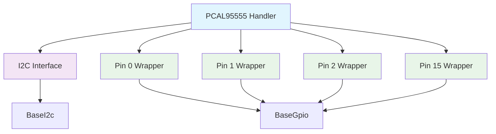

# PCAL95555 Handler

## Overview

The **PCAL95555 Handler** is a unified interface for the PCAL95555 16-bit I2C GPIO expander, providing high-level control over individual GPIO pins through a standard interface. This handler abstracts the I2C communication protocol and exposes each pin as a separate `BaseGpio` interface.

### Key Features

- **16-Bit GPIO Expansion**: 16 individually controllable GPIO pins
- **I2C Interface**: Standard I2C communication with configurable addressing
- **Per-Pin Wrapper**: Each pin exposed as a separate `BaseGpio` interface
- **Interrupt Support**: Configurable interrupt generation on pin state changes
- **Thread-Safe Operations**: All operations are thread-safe with proper synchronization
- **Error Handling**: Comprehensive error reporting and diagnostics
- **Power Management**: Low-power modes and configuration options

## Architecture

The PCAL95555 Handler uses the **Bridge Pattern** to decouple the GPIO expander logic from the I2C interface:



### I2C Interface

The handler communicates with the PCAL95555 through a standard I2C interface:

- **Address Range**: 0x20 to 0x27 (configurable via address pins)
- **Clock Frequency**: Up to 400 kHz (Fast-mode)
- **Data Format**: 8-bit data, MSB first
- **Register Access**: Direct register read/write operations

### Pin Wrapper System

Each of the 16 GPIO pins is exposed through a `Pcal95555GpioPin` wrapper that implements the `BaseGpio` interface:

- **Individual Control**: Each pin can be configured independently
- **Standard Interface**: Compatible with all `BaseGpio` operations
- **State Management**: Local state tracking for efficient operations
- **Error Propagation**: Pin-specific error reporting

## API Reference

### Initialization

```cpp
// Initialize with default I2C address (0x20)
Pcal95555Error Initialize(BaseI2c& i2c);

// Initialize with custom I2C address
Pcal95555Error Initialize(BaseI2c& i2c, uint8_t i2c_address);

// Initialize with custom configuration
Pcal95555Error Initialize(BaseI2c& i2c, uint8_t i2c_address, const Pcal95555Config& config);
```

### Pin Management

```cpp
// Get GPIO pin wrapper by pin number (0-15)
std::shared_ptr<BaseGpio> GetPin(uint8_t pin_number);

// Get all pins as a vector
std::vector<std::shared_ptr<BaseGpio>> GetAllPins();

// Check if pin is valid
bool IsValidPin(uint8_t pin_number) const noexcept;
```

### Configuration

```cpp
// Set device configuration
Pcal95555Error SetConfig(const Pcal95555Config& config);

// Get current device configuration
Pcal95555Config GetConfig() const noexcept;

// Set I2C address
Pcal95555Error SetI2cAddress(uint8_t address);

// Get current I2C address
uint8_t GetI2cAddress() const noexcept;
```

### Interrupt Management

```cpp
// Enable/disable interrupts for specific pin
Pcal95555Error EnableInterrupt(uint8_t pin_number, bool enable);

// Enable/disable interrupts for all pins
Pcal95555Error EnableAllInterrupts(bool enable);

// Check if interrupt is enabled for pin
bool IsInterruptEnabled(uint8_t pin_number) const noexcept;

// Read interrupt status
Pcal95555Error ReadInterruptStatus(uint16_t& interrupt_status);
```

### Diagnostics

```cpp
// Read device diagnostics
Pcal95555Error ReadDiagnostics(Pcal95555Diagnostics& diagnostics);

// Get error status
Pcal95555Error GetErrorStatus() const noexcept;

// Clear error status
Pcal95555Error ClearErrors();

// Test device communication
Pcal95555Error TestCommunication();
```

## Data Structures

### Configuration Structures

```cpp
struct Pcal95555Config {
    uint8_t i2c_address;
    uint16_t default_direction;      // 0=output, 1=input
    uint16_t default_pull_up;        // 0=disabled, 1=enabled
    uint16_t default_pull_down;      // 0=disabled, 1=enabled
    uint16_t default_output_level;   // 0=low, 1=high
    bool enable_interrupts;
    bool enable_power_management;
    uint32_t i2c_timeout_ms;
};

struct Pcal95555PinConfig {
    GpioDirection direction;
    GpioPullMode pull_mode;
    GpioLevel default_level;
    bool enable_interrupt;
    bool invert_logic;
};
```

### Diagnostic Structures

```cpp
struct Pcal95555Diagnostics {
    uint16_t input_state;
    uint16_t output_state;
    uint16_t direction_state;
    uint16_t pull_up_state;
    uint16_t pull_down_state;
    uint16_t interrupt_status;
    uint32_t communication_errors;
    uint32_t configuration_errors;
    uint64_t uptime_ms;
    float temperature;
    float supply_voltage;
};
```

### Error Codes

```cpp
enum class Pcal95555Error : uint8_t {
    OK = 0,
    NOT_INITIALIZED,
    INVALID_PARAMETER,
    INVALID_PIN,
    COMMUNICATION_ERROR,
    TIMEOUT_ERROR,
    CONFIGURATION_ERROR,
    INTERRUPT_ERROR,
    DIAGNOSTICS_ERROR,
    I2C_ERROR,
    REGISTER_ERROR
};
```

## Usage Examples

### Basic GPIO Control

```cpp
#include "Pcal95555Handler.h"

// Initialize I2C interface
EspI2c i2c;
i2c.Initialize(I2C_NUM_0, GPIO_NUM_21, GPIO_NUM_22, 100000);

// Create and initialize handler
Pcal95555Handler gpio_expander;
Pcal95555Error error = gpio_expander.Initialize(i2c, 0x20);
if (error != Pcal95555Error::OK) {
    Logger::Error("Failed to initialize PCAL95555: {}", static_cast<int>(error));
    return;
}

// Get individual pins
auto led_pin = gpio_expander.GetPin(0);
auto button_pin = gpio_expander.GetPin(1);

// Configure LED pin as output
led_pin->SetDirection(GpioDirection::OUTPUT);
led_pin->SetLevel(GpioLevel::HIGH);

// Configure button pin as input with pull-up
button_pin->SetDirection(GpioDirection::INPUT);
button_pin->SetPullMode(GpioPullMode::PULL_UP);
```

### Advanced Pin Configuration

```cpp
// Configure multiple pins with different settings
for (uint8_t i = 0; i < 8; i++) {
    auto pin = gpio_expander.GetPin(i);
    
    if (i < 4) {
        // First 4 pins as outputs
        pin->SetDirection(GpioDirection::OUTPUT);
        pin->SetLevel(GpioLevel::LOW);
    } else {
        // Next 4 pins as inputs with pull-down
        pin->SetDirection(GpioDirection::INPUT);
        pin->SetPullMode(GpioPullMode::PULL_DOWN);
    }
}

// Read all input pins
for (uint8_t i = 4; i < 8; i++) {
    auto pin = gpio_expander.GetPin(i);
    GpioLevel level = pin->GetLevel();
    Logger::Info("Pin {}: {}", i, (level == GpioLevel::HIGH) ? "HIGH" : "LOW");
}
```

### Interrupt Handling

```cpp
// Enable interrupts for specific pins
gpio_expander.EnableInterrupt(1, true);  // Button pin
gpio_expander.EnableInterrupt(2, true);  // Sensor pin

// Read interrupt status
uint16_t interrupt_status;
Pcal95555Error error = gpio_expander.ReadInterruptStatus(interrupt_status);
if (error == Pcal95555Error::OK) {
    for (uint8_t i = 0; i < 16; i++) {
        if (interrupt_status & (1 << i)) {
            Logger::Info("Interrupt on pin {}", i);
            
            // Read pin state
            auto pin = gpio_expander.GetPin(i);
            GpioLevel level = pin->GetLevel();
            Logger::Info("Pin {} state: {}", i, (level == GpioLevel::HIGH) ? "HIGH" : "LOW");
        }
    }
}
```

### Configuration Management

```cpp
// Advanced configuration
Pcal95555Config config = {
    .i2c_address = 0x20,
    .default_direction = 0x00FF,        // Pins 0-7 as outputs, 8-15 as inputs
    .default_pull_up = 0xFF00,          // Pull-up on input pins
    .default_pull_down = 0x0000,        // No pull-down
    .default_output_level = 0x0000,     // All outputs start low
    .enable_interrupts = true,
    .enable_power_management = true,
    .i2c_timeout_ms = 100
};

Pcal95555Error error = gpio_expander.Initialize(i2c, 0x20, config);
if (error != Pcal95555Error::OK) {
    Logger::Error("Failed to initialize with config: {}", static_cast<int>(error));
    return;
}
```

### Diagnostics and Monitoring

```cpp
// Read device diagnostics
Pcal95555Diagnostics diagnostics;
Pcal95555Error error = gpio_expander.ReadDiagnostics(diagnostics);
if (error == Pcal95555Error::OK) {
    Logger::Info("Input State: 0x{:04X}", diagnostics.input_state);
    Logger::Info("Output State: 0x{:04X}", diagnostics.output_state);
    Logger::Info("Direction State: 0x{:04X}", diagnostics.direction_state);
    Logger::Info("Communication Errors: {}", diagnostics.communication_errors);
    Logger::Info("Supply Voltage: {:.2f}V", diagnostics.supply_voltage);
    
    if (diagnostics.communication_errors > 0) {
        Logger::Warn("Communication errors detected");
    }
}
```

## Thread Safety

The PCAL95555 Handler is **thread-safe** and implements the following safety mechanisms:

### Synchronization

- **Mutex Protection**: All critical operations are protected by `RtosMutex`
- **Atomic Operations**: Pin states and configuration values use atomic operations
- **Exception Safety**: All public methods are `noexcept` or have strong exception guarantees

### Concurrent Access

```cpp
// Safe concurrent access from multiple threads
std::thread output_thread([&gpio_expander]() {
    auto led_pin = gpio_expander.GetPin(0);
    while (true) {
        led_pin->SetLevel(GpioLevel::HIGH);
        std::this_thread::sleep_for(std::chrono::milliseconds(500));
        led_pin->SetLevel(GpioLevel::LOW);
        std::this_thread::sleep_for(std::chrono::milliseconds(500));
    }
});

std::thread input_thread([&gpio_expander]() {
    auto button_pin = gpio_expander.GetPin(1);
    while (true) {
        GpioLevel level = button_pin->GetLevel();
        if (level == GpioLevel::HIGH) {
            Logger::Info("Button pressed");
        }
        std::this_thread::sleep_for(std::chrono::milliseconds(100));
    }
});
```

## Performance Considerations

### Communication Performance

- **I2C Speed**: Up to 400 kHz for fast communication
- **Burst Operations**: Optimized for multiple pin reads/writes
- **Register Caching**: Local state caching to minimize I2C traffic

### Real-Time Performance

- **Pin Access Latency**: < 1ms for individual pin operations
- **Interrupt Response**: < 100μs for interrupt detection
- **Bulk Operations**: Efficient handling of multiple pin operations

### Memory Usage

- **Static Memory**: ~1KB for handler instance
- **Dynamic Memory**: ~2KB for pin wrappers (16 pins)
- **Buffer Management**: Efficient buffer reuse for I2C communication

## Hardware Requirements

### PCAL95555 GPIO Expander

- **Supply Voltage**: 1.65V to 5.5V
- **I2C Address**: 0x20 to 0x27 (configurable)
- **GPIO Pins**: 16 individually controllable pins
- **Temperature Range**: -40°C to +85°C
- **Current Rating**: 25mA per pin, 200mA total

### Interface Requirements

#### I2C Interface
- **Clock Frequency**: Up to 400 kHz (Fast-mode)
- **Address Range**: 0x20 to 0x27
- **Data Format**: 8-bit data, MSB first
- **Pull-up Resistors**: Required on SDA and SCL lines

### Power Supply

- **Logic Supply**: 1.65V to 5.5V
- **Current Rating**: Sufficient for connected loads
- **Decoupling**: Proper bypass capacitors required
- **ESD Protection**: Built-in ESD protection on all pins

## Troubleshooting

### Common Issues

#### Communication Errors

**Problem**: `Pcal95555Error::COMMUNICATION_ERROR`
```cpp
// Check I2C configuration
if (error == Pcal95555Error::COMMUNICATION_ERROR) {
    // Verify I2C settings
    Logger::Warn("Check I2C clock frequency (≤ 400 kHz)");
    Logger::Warn("Verify I2C address (0x20-0x27)");
    Logger::Warn("Check pull-up resistors on SDA/SCL");
    Logger::Warn("Verify wiring connections");
}
```

**Solutions**:
- Verify I2C clock frequency (≤ 400 kHz)
- Check I2C address configuration
- Ensure proper pull-up resistors
- Verify wiring connections

#### Pin Configuration Issues

**Problem**: Pin not responding to commands
```cpp
// Check pin configuration
auto pin = gpio_expander.GetPin(pin_number);
if (!pin) {
    Logger::Error("Invalid pin number: {}", pin_number);
    return;
}

// Verify pin direction
GpioDirection direction = pin->GetDirection();
Logger::Info("Pin {} direction: {}", pin_number, 
    (direction == GpioDirection::OUTPUT) ? "OUTPUT" : "INPUT");
```

**Solutions**:
- Verify pin number (0-15)
- Check pin direction configuration
- Ensure proper power supply
- Verify pin connections

#### Interrupt Issues

**Problem**: Interrupts not working
```cpp
// Check interrupt configuration
bool interrupt_enabled = gpio_expander.IsInterruptEnabled(pin_number);
Logger::Info("Interrupt enabled for pin {}: {}", pin_number, interrupt_enabled);

// Read interrupt status
uint16_t interrupt_status;
gpio_expander.ReadInterruptStatus(interrupt_status);
Logger::Info("Interrupt status: 0x{:04X}", interrupt_status);
```

**Solutions**:
- Enable interrupts for specific pins
- Check interrupt pin configuration
- Verify interrupt handling code
- Monitor interrupt status register

### Diagnostic Tools

#### Communication Test

```cpp
// Test device communication
Pcal95555Error error = gpio_expander.TestCommunication();
if (error == Pcal95555Error::OK) {
    Logger::Info("PCAL95555 communication test passed");
} else {
    Logger::Error("PCAL95555 communication test failed: {}", static_cast<int>(error));
}
```

#### Pin State Monitoring

```cpp
// Monitor all pin states
for (uint8_t i = 0; i < 16; i++) {
    auto pin = gpio_expander.GetPin(i);
    if (pin) {
        GpioDirection direction = pin->GetDirection();
        GpioLevel level = pin->GetLevel();
        Logger::Info("Pin {}: {} {}", i, 
            (direction == GpioDirection::OUTPUT) ? "OUT" : "IN",
            (level == GpioLevel::HIGH) ? "HIGH" : "LOW");
    }
}
```

### Debug Configuration

```cpp
// Enable debug logging
Logger::SetLogLevel(LogLevel::DEBUG);

// Monitor I2C operations
Logger::Debug("Setting pin {} to {}", pin_number, level);
Pcal95555Error error = pin->SetLevel(level);
Logger::Debug("Pin set result: {}", static_cast<int>(error));
```

## Integration Examples

### ESP32 Integration

```cpp
#include "Pcal95555Handler.h"
#include "EspI2c.h"
#include "EspGpio.h"

// ESP32-specific initialization
EspI2c i2c;
i2c.Initialize(I2C_NUM_0, GPIO_NUM_21, GPIO_NUM_22, 100000);

Pcal95555Handler gpio_expander;
gpio_expander.Initialize(i2c, 0x20);

// Use pins for various purposes
auto status_led = gpio_expander.GetPin(0);
auto reset_button = gpio_expander.GetPin(1);
auto sensor_power = gpio_expander.GetPin(2);

status_led->SetDirection(GpioDirection::OUTPUT);
reset_button->SetDirection(GpioDirection::INPUT);
reset_button->SetPullMode(GpioPullMode::PULL_UP);
sensor_power->SetDirection(GpioDirection::OUTPUT);
```

### STM32 Integration

```cpp
#include "Pcal95555Handler.h"
#include "Stm32I2c.h"
#include "Stm32Gpio.h"

// STM32-specific initialization
Stm32I2c i2c;
i2c.Initialize(I2C1, GPIOB, GPIO_PIN_6, GPIOB, GPIO_PIN_7);

Pcal95555Handler gpio_expander;
gpio_expander.Initialize(i2c, 0x20);

// Use pins for motor control
auto motor_enable = gpio_expander.GetPin(0);
auto direction_pin = gpio_expander.GetPin(1);
auto fault_input = gpio_expander.GetPin(2);

motor_enable->SetDirection(GpioDirection::OUTPUT);
direction_pin->SetDirection(GpioDirection::OUTPUT);
fault_input->SetDirection(GpioDirection::INPUT);
```

### Arduino Integration

```cpp
#include "Pcal95555Handler.h"
#include "ArduinoI2c.h"
#include "ArduinoGpio.h"

// Arduino-specific initialization
ArduinoI2c i2c;
i2c.Initialize();

Pcal95555Handler gpio_expander;
gpio_expander.Initialize(i2c, 0x20);

// Use pins for display control
auto lcd_rs = gpio_expander.GetPin(0);
auto lcd_en = gpio_expander.GetPin(1);
auto lcd_d4 = gpio_expander.GetPin(2);
auto lcd_d5 = gpio_expander.GetPin(3);
auto lcd_d6 = gpio_expander.GetPin(4);
auto lcd_d7 = gpio_expander.GetPin(5);

// Configure all display pins as outputs
for (uint8_t i = 0; i < 6; i++) {
    auto pin = gpio_expander.GetPin(i);
    pin->SetDirection(GpioDirection::OUTPUT);
    pin->SetLevel(GpioLevel::LOW);
}
```

## Best Practices

### Configuration

1. **Plan Pin Usage**: Design pin assignments before implementation
2. **Use Pull-up/Pull-down**: Configure appropriate pull resistors for inputs
3. **Set Default States**: Configure safe default states for all pins
4. **Enable Interrupts**: Use interrupts for efficient input monitoring

### Operation

1. **Validate Pin Numbers**: Always check pin validity before use
2. **Monitor Communication**: Regularly check for communication errors
3. **Handle Interrupts**: Implement proper interrupt handling
4. **Resource Management**: Properly manage pin wrapper resources

### Performance

1. **Optimize I2C Usage**: Batch operations when possible
2. **Cache Pin States**: Use local state caching for efficiency
3. **Monitor Errors**: Track communication and configuration errors
4. **Regular Maintenance**: Periodically test device communication

## Related Documentation

- [Architecture Overview](../architecture.md)
- [Integration Guide](../integration.md)
- [Base I2C Interface](../api/base-i2c.md)
- [Base GPIO Interface](../api/base-gpio.md)
- [Error Handling Guide](../api/error-handling.md) 