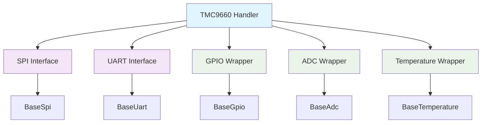

# TMC9660 Handler

## Overview

The **TMC9660 Handler** is a unified interface for the TMC9660 motor controller, providing high-level control over BLDC motors with integrated GPIO and ADC functionality. This handler abstracts the complex TMC9660 communication protocols and exposes internal hardware resources through standard interfaces.

### Key Features

- **Dual Communication Support**: SPI and UART interfaces
- **Motor Control**: BLDC motor control with velocity and position feedback
- **Integrated GPIO**: Access to internal GPIO pins through `BaseGpio` interface
- **Integrated ADC**: Access to internal ADC channels through `BaseAdc` interface
- **Temperature Monitoring**: Built-in temperature sensor access through `BaseTemperature` interface
- **Thread-Safe Operations**: All operations are thread-safe with proper synchronization
- **Error Handling**: Comprehensive error reporting and diagnostics

## Architecture

The TMC9660 Handler uses the **Bridge Pattern** to decouple the motor controller logic from the communication interface:



### Communication Interfaces

The handler supports two communication methods:

1. **SPI Interface** (`Tmc9660SpiCommInterface`)
   - High-speed synchronous communication
   - Full-duplex data transfer
   - Configurable clock polarity and phase

2. **UART Interface** (`Tmc9660UartCommInterface`)
   - Asynchronous serial communication
   - Configurable baud rate and parity
   - Suitable for longer cable runs

### Internal Resource Wrappers

The TMC9660 exposes its internal hardware through standard interfaces:

- **GPIO Wrapper**: Access to internal GPIO pins
- **ADC Wrapper**: Access to internal ADC channels
- **Temperature Wrapper**: Access to built-in temperature sensor

## API Reference

### Initialization

```cpp
// Initialize with SPI interface
Tmc9660Error Initialize(BaseSpi& spi, uint8_t cs_pin);

// Initialize with UART interface
Tmc9660Error Initialize(BaseUart& uart);

// Initialize with custom configuration
Tmc9660Error Initialize(BaseSpi& spi, uint8_t cs_pin, const Tmc9660Config& config);
Tmc9660Error Initialize(BaseUart& uart, const Tmc9660Config& config);
```

### Motor Control

```cpp
// Set motor velocity (RPM)
Tmc9660Error SetVelocity(float velocity_rpm);

// Get current velocity
float GetVelocity() const noexcept;

// Set motor position (encoder counts)
Tmc9660Error SetPosition(int32_t position);

// Get current position
int32_t GetPosition() const noexcept;

// Enable/disable motor
Tmc9660Error EnableMotor(bool enable);

// Check if motor is enabled
bool IsMotorEnabled() const noexcept;
```

### Configuration

```cpp
// Set motor configuration
Tmc9660Error SetMotorConfig(const Tmc9660MotorConfig& config);

// Get current motor configuration
Tmc9660MotorConfig GetMotorConfig() const noexcept;

// Set communication configuration
Tmc9660Error SetCommConfig(const Tmc9660CommConfig& config);

// Get current communication configuration
Tmc9660CommConfig GetCommConfig() const noexcept;
```

### Diagnostics

```cpp
// Read diagnostics information
Tmc9660Error ReadDiagnostics(Tmc9660Diagnostics& diagnostics);

// Get error status
Tmc9660Error GetErrorStatus() const noexcept;

// Clear error status
Tmc9660Error ClearErrors();

// Get temperature
float GetTemperature() const noexcept;
```

### Internal Resource Access

```cpp
// Get GPIO wrapper
std::shared_ptr<BaseGpio> GetGpio(uint8_t pin_number);

// Get ADC wrapper
std::shared_ptr<BaseAdc> GetAdc(uint8_t channel);

// Get temperature wrapper
std::shared_ptr<BaseTemperature> GetTemperatureSensor();
```

### Temperature Sensor Details

The TMC9660 internal temperature sensor provides comprehensive monitoring capabilities:

#### Sensor Specifications
- **Temperature Range**: -40°C to +150°C
- **Resolution**: ~0.1°C
- **Accuracy**: ±2°C (typical for chip temperature sensors)
- **Response Time**: ~100ms
- **Conversion Formula**: `T(°C) = raw_value × 0.01615 - 268.15`

#### Advanced Temperature Features

```cpp
// Read temperature with full details
hf_temp_reading_t reading;
if (temp_sensor->ReadTemperature(&reading) == hf_temp_err_t::TEMP_SUCCESS) {
    printf("Temperature: %.2f°C\n", reading.temperature_celsius);
    printf("Raw value: %.2f\n", reading.temperature_raw);
    printf("Timestamp: %llu us\n", reading.timestamp_us);
    printf("Accuracy: %.2f°C\n", reading.accuracy_celsius);
    printf("Valid: %s\n", reading.is_valid ? "YES" : "NO");
}

// Get sensor capabilities
hf_u32_t capabilities = temp_sensor->GetCapabilities();
if (temp_sensor->HasCapability(HF_TEMP_CAP_HIGH_PRECISION)) {
    printf("High precision supported\n");
}
if (temp_sensor->HasCapability(HF_TEMP_CAP_FAST_RESPONSE)) {
    printf("Fast response supported\n");
}

// Get comprehensive statistics
hf_temp_statistics_t stats;
if (temp_sensor->GetStatistics(stats) == hf_temp_err_t::TEMP_SUCCESS) {
    printf("Total readings: %d\n", stats.temperature_readings);
    printf("Success rate: %.1f%%\n", 
           (float)stats.successful_operations / stats.total_operations * 100.0f);
    printf("Min temperature: %.2f°C\n", stats.min_temperature_celsius);
    printf("Max temperature: %.2f°C\n", stats.max_temperature_celsius);
    printf("Average temperature: %.2f°C\n", stats.avg_temperature_celsius);
}

// Get diagnostic information
hf_temp_diagnostics_t diagnostics;
if (temp_sensor->GetDiagnostics(diagnostics) == hf_temp_err_t::TEMP_SUCCESS) {
    printf("Sensor healthy: %s\n", diagnostics.sensor_healthy ? "YES" : "NO");
    printf("Sensor available: %s\n", diagnostics.sensor_available ? "YES" : "NO");
    printf("Consecutive errors: %d\n", diagnostics.consecutive_errors);
}
```

## Data Structures

### Configuration Structures

```cpp
struct Tmc9660Config {
    Tmc9660MotorConfig motor_config;
    Tmc9660CommConfig comm_config;
    bool enable_diagnostics;
    uint32_t diagnostics_interval_ms;
};

struct Tmc9660MotorConfig {
    uint16_t pole_pairs;
    float max_velocity_rpm;
    float acceleration_rpm_per_sec;
    float deceleration_rpm_per_sec;
    uint16_t pwm_frequency_hz;
    uint8_t pwm_dead_time_ns;
};

struct Tmc9660CommConfig {
    uint32_t spi_clock_hz;
    uint8_t spi_mode;
    uint32_t uart_baud_rate;
    uint8_t uart_data_bits;
    uint8_t uart_parity;
    uint8_t uart_stop_bits;
};
```

### Diagnostic Structures

```cpp
struct Tmc9660Diagnostics {
    float motor_voltage;
    float motor_current;
    float motor_power;
    float motor_temperature;
    uint32_t error_flags;
    uint32_t warning_flags;
    uint32_t status_flags;
    uint64_t uptime_ms;
    uint32_t communication_errors;
    uint32_t motor_errors;
};
```

### Error Codes

```cpp
enum class Tmc9660Error : uint8_t {
    OK = 0,
    NOT_INITIALIZED,
    INVALID_PARAMETER,
    COMMUNICATION_ERROR,
    MOTOR_ERROR,
    TIMEOUT_ERROR,
    CONFIGURATION_ERROR,
    DIAGNOSTICS_ERROR,
    GPIO_ERROR,
    ADC_ERROR,
    TEMPERATURE_ERROR
};
```

## Usage Examples

### Basic Motor Control

```cpp
#include "Tmc9660Handler.h"

// Initialize SPI interface
EspSpi spi;
spi.Initialize(SPI2_HOST, GPIO_NUM_23, GPIO_NUM_19, GPIO_NUM_18, GPIO_NUM_5);

// Create and initialize handler
Tmc9660Handler motor_controller;
Tmc9660Error error = motor_controller.Initialize(spi, GPIO_NUM_5);
if (error != Tmc9660Error::OK) {
    Logger::Error("Failed to initialize TMC9660: {}", static_cast<int>(error));
    return;
}

// Configure motor
Tmc9660MotorConfig motor_config = {
    .pole_pairs = 14,
    .max_velocity_rpm = 3000.0f,
    .acceleration_rpm_per_sec = 1000.0f,
    .deceleration_rpm_per_sec = 1000.0f,
    .pwm_frequency_hz = 20000,
    .pwm_dead_time_ns = 100
};
motor_controller.SetMotorConfig(motor_config);

// Enable motor and set velocity
motor_controller.EnableMotor(true);
motor_controller.SetVelocity(1500.0f); // 1500 RPM
```

### Using Internal Resources

```cpp
// Access internal GPIO
auto gpio_pin = motor_controller.GetGpio(0);
if (gpio_pin) {
    gpio_pin->SetDirection(GpioDirection::OUTPUT);
    gpio_pin->SetLevel(GpioLevel::HIGH);
}

// Access internal ADC
auto adc_channel = motor_controller.GetAdc(0);
if (adc_channel) {
    adc_channel->SetResolution(AdcResolution::BITS_12);
    uint16_t value = adc_channel->Read();
    Logger::Info("ADC Value: {}", value);
}

// Access temperature sensor
auto temp_sensor = motor_controller.GetTemperatureSensor();
if (temp_sensor) {
    float temperature = temp_sensor->ReadTemperature();
    Logger::Info("Motor Temperature: {:.1f}°C", temperature);
}
```

### Diagnostics and Monitoring

```cpp
// Read diagnostics periodically
Tmc9660Diagnostics diagnostics;
Tmc9660Error error = motor_controller.ReadDiagnostics(diagnostics);
if (error == Tmc9660Error::OK) {
    Logger::Info("Motor Voltage: {:.1f}V", diagnostics.motor_voltage);
    Logger::Info("Motor Current: {:.2f}A", diagnostics.motor_current);
    Logger::Info("Motor Power: {:.1f}W", diagnostics.motor_power);
    Logger::Info("Motor Temperature: {:.1f}°C", diagnostics.motor_temperature);
    
    if (diagnostics.error_flags != 0) {
        Logger::Warn("Motor errors detected: 0x{:08X}", diagnostics.error_flags);
    }
}
```

### Advanced Configuration

```cpp
// Advanced configuration with diagnostics
Tmc9660Config config = {
    .motor_config = {
        .pole_pairs = 14,
        .max_velocity_rpm = 3000.0f,
        .acceleration_rpm_per_sec = 1000.0f,
        .deceleration_rpm_per_sec = 1000.0f,
        .pwm_frequency_hz = 20000,
        .pwm_dead_time_ns = 100
    },
    .comm_config = {
        .spi_clock_hz = 1000000,
        .spi_mode = 0,
        .uart_baud_rate = 115200,
        .uart_data_bits = 8,
        .uart_parity = 0,
        .uart_stop_bits = 1
    },
    .enable_diagnostics = true,
    .diagnostics_interval_ms = 100
};

Tmc9660Error error = motor_controller.Initialize(spi, GPIO_NUM_5, config);
```

## Thread Safety

The TMC9660 Handler is **thread-safe** and implements the following safety mechanisms:

### Synchronization

- **Mutex Protection**: All critical operations are protected by `RtosMutex`
- **Atomic Operations**: Status flags and configuration values use atomic operations
- **Exception Safety**: All public methods are `noexcept` or have strong exception guarantees

### Concurrent Access

```cpp
// Safe concurrent access from multiple threads
std::thread control_thread([&motor_controller]() {
    while (true) {
        motor_controller.SetVelocity(1500.0f);
        std::this_thread::sleep_for(std::chrono::milliseconds(100));
    }
});

std::thread monitor_thread([&motor_controller]() {
    while (true) {
        float velocity = motor_controller.GetVelocity();
        float temperature = motor_controller.GetTemperature();
        Logger::Info("Velocity: {:.1f} RPM, Temp: {:.1f}°C", velocity, temperature);
        std::this_thread::sleep_for(std::chrono::milliseconds(500));
    }
});
```

## Performance Considerations

### Communication Performance

- **SPI Mode**: Up to 1 MHz clock frequency for high-speed control
- **UART Mode**: Up to 115200 baud for reliable long-distance communication
- **Burst Transfers**: Optimized for multiple register reads/writes

### Real-Time Performance

- **Control Loop Latency**: < 1ms for velocity control updates
- **Diagnostics Overhead**: Configurable update intervals (default: 100ms)
- **Resource Access**: Direct access to internal GPIO/ADC without communication overhead

### Memory Usage

- **Static Memory**: ~2KB for handler instance
- **Dynamic Memory**: Minimal heap usage for configuration storage
- **Buffer Management**: Efficient buffer reuse for communication

## Hardware Requirements

### TMC9660 Motor Controller

- **Supply Voltage**: 6V to 60V
- **Output Current**: Up to 20A continuous
- **Communication**: SPI or UART
- **Temperature Range**: -40°C to +125°C

### Interface Requirements

#### SPI Interface
- **Clock Frequency**: Up to 1 MHz
- **Data Format**: 8-bit data, MSB first
- **CS Pin**: Required for device selection
- **Mode**: Configurable (0-3)

#### UART Interface
- **Baud Rate**: 9600 to 115200
- **Data Format**: 8N1 (configurable)
- **Flow Control**: None required

### Power Supply

- **Logic Supply**: 3.3V or 5V
- **Motor Supply**: 6V to 60V
- **Current Rating**: Sufficient for motor requirements
- **Decoupling**: Proper bypass capacitors required

## Troubleshooting

### Common Issues

#### Communication Errors

**Problem**: `Tmc9660Error::COMMUNICATION_ERROR`
```cpp
// Check SPI configuration
if (error == Tmc9660Error::COMMUNICATION_ERROR) {
    // Verify SPI settings
    Logger::Warn("Check SPI clock frequency and mode");
    Logger::Warn("Verify CS pin configuration");
    Logger::Warn("Check wiring connections");
}
```

**Solutions**:
- Verify SPI clock frequency (≤ 1 MHz)
- Check SPI mode configuration
- Ensure proper CS pin setup
- Verify wiring connections

#### Motor Control Issues

**Problem**: Motor not responding to commands
```cpp
// Check motor configuration
Tmc9660MotorConfig config = motor_controller.GetMotorConfig();
Logger::Info("Pole pairs: {}", config.pole_pairs);
Logger::Info("Max velocity: {:.1f} RPM", config.max_velocity_rpm);

// Check motor enable status
if (!motor_controller.IsMotorEnabled()) {
    Logger::Warn("Motor is disabled");
    motor_controller.EnableMotor(true);
}
```

**Solutions**:
- Verify pole pair configuration
- Check motor enable status
- Ensure proper power supply
- Verify motor connections

#### Temperature Issues

**Problem**: High temperature readings
```cpp
// Monitor temperature
float temp = motor_controller.GetTemperature();
if (temp > 80.0f) {
    Logger::Warn("High motor temperature: {:.1f}°C", temp);
    // Reduce load or implement thermal protection
}
```

**Solutions**:
- Check motor load
- Verify cooling system
- Implement thermal protection
- Monitor ambient temperature

#### Temperature Sensor Issues

**Problem**: Temperature reads -273°C or out of range
```cpp
// Check temperature sensor status
auto temp_sensor = motor_controller.GetTemperatureSensor();
hf_temp_diagnostics_t diagnostics;
if (temp_sensor->GetDiagnostics(diagnostics) == hf_temp_err_t::TEMP_SUCCESS) {
    if (!diagnostics.sensor_healthy) {
        Logger::Error("Temperature sensor unhealthy");
    }
    if (diagnostics.consecutive_errors > 5) {
        Logger::Warn("High consecutive error count: {}", diagnostics.consecutive_errors);
    }
}
```

**Solutions**:
- Verify TMC9660 communication interface
- Check if temperature is within -40°C to +150°C range
- Ensure TMC9660 handler is properly initialized
- Monitor consecutive error count

#### Multi-Sensor Temperature Integration

```cpp
// Example: Multiple temperature sensors
std::vector<BaseTemperature*> temperature_sensors;

// Add TMC9660 temperature sensor
auto temp_sensor = motor_controller.GetTemperatureSensor();
temperature_sensors.push_back(temp_sensor.get());

// Add other temperature sensors (e.g., external sensors)
// temperature_sensors.push_back(&external_temp_sensor);

// Read all temperatures
for (auto* sensor : temperature_sensors) {
    float temp = 0.0f;
    if (sensor->ReadTemperatureCelsius(&temp) == hf_temp_err_t::TEMP_SUCCESS) {
        Logger::Info("Temperature: {:.2f}°C", temp);
    }
}
```

### Diagnostic Tools

#### Error Status Monitoring

```cpp
// Monitor error status
Tmc9660Error error_status = motor_controller.GetErrorStatus();
if (error_status != Tmc9660Error::OK) {
    Logger::Error("Motor error: {}", static_cast<int>(error_status));
    motor_controller.ClearErrors();
}
```

#### Performance Monitoring

```cpp
// Monitor communication performance
Tmc9660Diagnostics diagnostics;
motor_controller.ReadDiagnostics(diagnostics);
Logger::Info("Communication errors: {}", diagnostics.communication_errors);
Logger::Info("Motor errors: {}", diagnostics.motor_errors);
```

### Debug Configuration

```cpp
// Enable debug logging
Logger::SetLogLevel(LogLevel::DEBUG);

// Monitor all operations
Logger::Debug("Setting velocity to {:.1f} RPM", velocity);
Tmc9660Error error = motor_controller.SetVelocity(velocity);
Logger::Debug("Velocity set result: {}", static_cast<int>(error));
```

## Integration Examples

### ESP32 Integration

```cpp
#include "Tmc9660Handler.h"
#include "EspSpi.h"
#include "EspGpio.h"

// ESP32-specific initialization
EspSpi spi;
spi.Initialize(SPI2_HOST, GPIO_NUM_23, GPIO_NUM_19, GPIO_NUM_18, GPIO_NUM_5);

Tmc9660Handler motor_controller;
motor_controller.Initialize(spi, GPIO_NUM_5);

// Use internal GPIO for status LED
auto status_led = motor_controller.GetGpio(1);
status_led->SetDirection(GpioDirection::OUTPUT);
```

### STM32 Integration

```cpp
#include "Tmc9660Handler.h"
#include "Stm32Spi.h"
#include "Stm32Gpio.h"

// STM32-specific initialization
Stm32Spi spi;
spi.Initialize(SPI1, GPIOA, GPIO_PIN_5, GPIOA, GPIO_PIN_6, GPIOA, GPIO_PIN_7);

Tmc9660Handler motor_controller;
motor_controller.Initialize(spi, GPIO_PIN_4);

// Use internal ADC for current monitoring
auto current_sensor = motor_controller.GetAdc(0);
current_sensor->SetResolution(AdcResolution::BITS_12);
```

### Arduino Integration

```cpp
#include "Tmc9660Handler.h"
#include "ArduinoSpi.h"
#include "ArduinoGpio.h"

// Arduino-specific initialization
ArduinoSpi spi;
spi.Initialize(10, 11, 12, 13); // CS, MOSI, MISO, SCK

Tmc9660Handler motor_controller;
motor_controller.Initialize(spi, 10);

// Use internal temperature sensor
auto temp_sensor = motor_controller.GetTemperatureSensor();
float temp = temp_sensor->ReadTemperature();
Serial.print("Temperature: ");
Serial.println(temp);
```

## Best Practices

### Configuration

1. **Start with Conservative Settings**: Begin with lower velocity and acceleration limits
2. **Verify Hardware Setup**: Double-check all connections before power-up
3. **Use Proper Power Supply**: Ensure adequate current rating and voltage stability
4. **Implement Safety Features**: Add emergency stop and thermal protection

### Operation

1. **Monitor Diagnostics**: Regularly check temperature and error status
2. **Gradual Ramp-up**: Use acceleration/deceleration limits for smooth operation
3. **Error Handling**: Implement proper error recovery mechanisms
4. **Resource Management**: Properly manage GPIO and ADC resources

### Performance

1. **Optimize Communication**: Use appropriate SPI clock frequency
2. **Minimize Overhead**: Batch operations when possible
3. **Monitor Resources**: Track memory and CPU usage
4. **Regular Maintenance**: Periodically check and calibrate sensors

## Related Documentation

- [Architecture Overview](../architecture.md)
- [Integration Guide](../integration.md)
- [Base SPI Interface](../api/base-spi.md)
- [Base GPIO Interface](../api/base-gpio.md)
- [Base ADC Interface](../api/base-adc.md)
- [Base Temperature Interface](../api/base-temperature.md)
- [Error Handling Guide](../api/error-handling.md) 